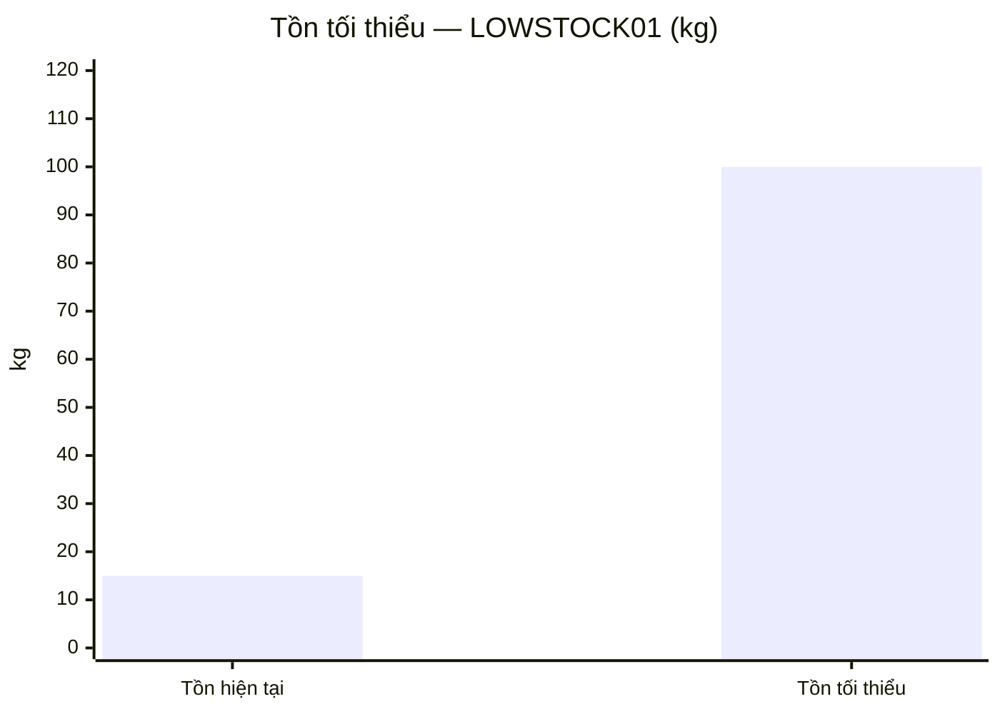
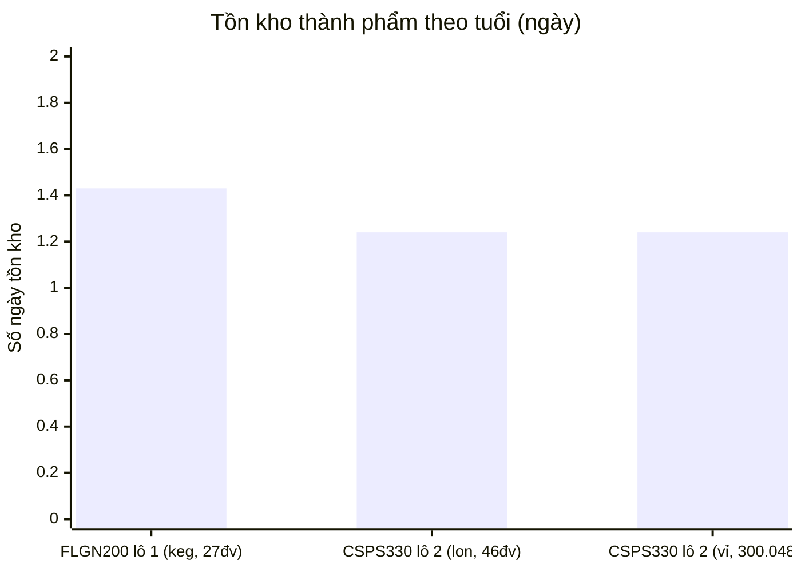
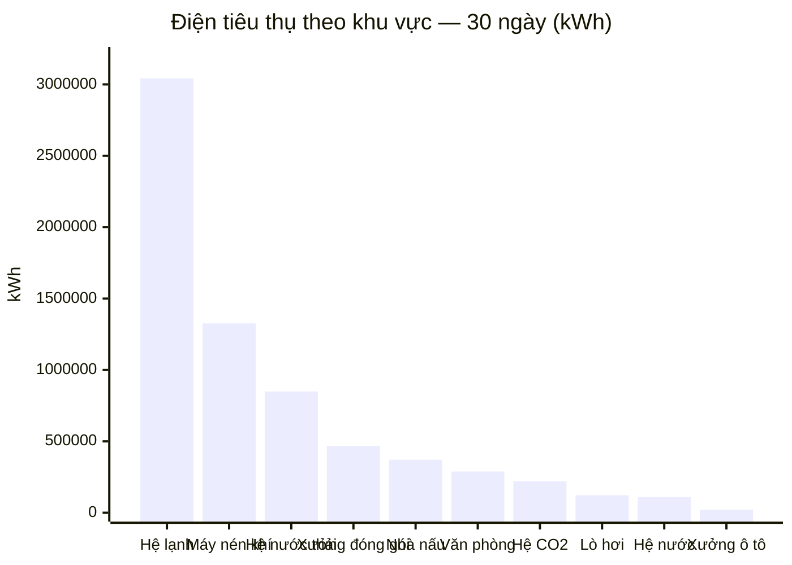
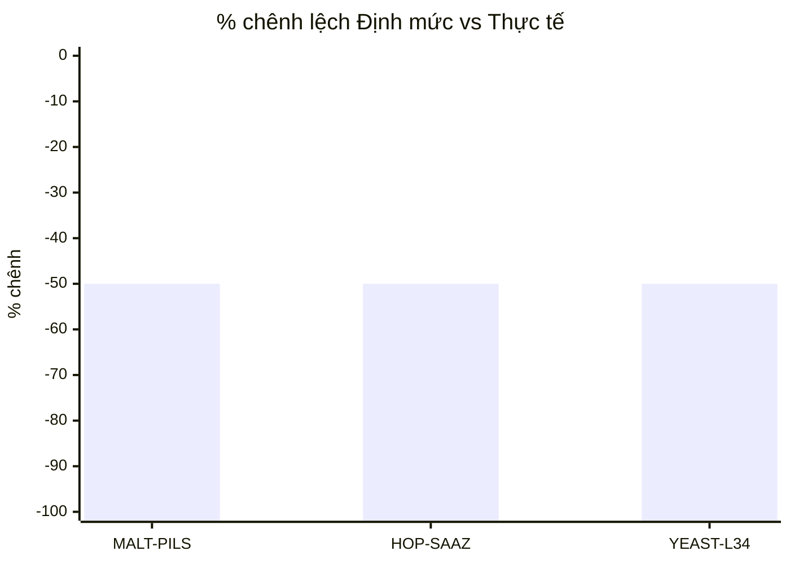

# Hướng dẫn sử dụng phần mềm MES Bia Hạ Long

**Nhà máy Đông Mai — Hệ thống điều hành sản xuất (Manufacturing Execution System)**

> Phiên bản phần mềm: `0.1.0-mvp` · Tài liệu cập nhật: **22/07/2026** (bản chạy lại buổi chiều), biên soạn bằng cách lấy trực tiếp dữ liệu và thao tác thật trên máy chủ đang chạy tại thời điểm này (không phải bản đề xuất/kế hoạch, không phải mô tả chung chung). Mỗi mục đều có: mục đích, ai dùng, các bước thao tác cụ thể (đúng tên trường/nút bấm thật), số liệu thật minh hoạ, và ở những chỗ phần mềm có vẽ biểu đồ, tài liệu vẽ lại đúng biểu đồ đó dạng Mermaid (`xychart-beta`) ngay từ số liệu thật — không phải ảnh chụp màn hình tĩnh. Mermaid hiển thị trực tiếp trên GitHub/GitLab và VS Code (cần bật extension Markdown Preview Mermaid Support); nếu trình xem không hỗ trợ, bảng số liệu ngay bên dưới mỗi biểu đồ vẫn đọc được bình thường.

---

## Mục lục

1. [Đăng nhập & tài khoản demo](#1-đăng-nhập--tài-khoản-demo)
2. [Tổng quan (Dashboard)](#2-tổng-quan-dashboard)
3. [Sơ đồ quy trình](#3-sơ-đồ-quy-trình)
4. [Lệnh sản xuất (Lệnh nấu / Lệnh lọc)](#4-lệnh-sản-xuất-lệnh-nấu--lệnh-lọc)
5. [Điều độ (Work Order)](#5-điều-độ-work-order)
6. [Lập lịch sản xuất](#6-lập-lịch-sản-xuất)
7. [Công thức (Recipe/BOM)](#7-công-thức-recipebom)
8. [Chất lượng (QC) & QC Lab](#8-chất-lượng-qc--qc-lab)
9. [Nấu — Lọc — Chiết (công đoạn sản xuất chính)](#9-nấu--lọc--chiết-công-đoạn-sản-xuất-chính)
10. [Truy xuất nguồn gốc](#10-truy-xuất-nguồn-gốc)
11. [Kho NVL](#11-kho-nvl)
12. [Kho thành phẩm (WMS)](#12-kho-thành-phẩm-wms)
13. [Bao bì](#13-bao-bì)
14. [Năng lượng](#14-năng-lượng)
15. [OEE / Dừng máy](#15-oee--dừng-máy)
16. [Bảo trì / Kiểm định](#16-bảo-trì--kiểm-định)
17. [Báo cáo](#17-báo-cáo)
18. [Trợ lý AI](#18-trợ-lý-ai)
19. [Tích hợp (API/Webhook/Kết nối CSDL)](#19-tích-hợp-apiwebhookkết-nối-csdl)
20. [Danh mục (Master data)](#20-danh-mục-master-data)
21. [Tài khoản & phân quyền](#21-tài-khoản--phân-quyền)
22. [Audit — nhật ký hệ thống](#22-audit--nhật-ký-hệ-thống)
23. [Hồ sơ cá nhân](#23-hồ-sơ-cá-nhân)

---

## 1. Đăng nhập & tài khoản demo

**Mục đích:** xác thực người dùng, xác định vai trò/quyền thao tác cho mọi hành động tiếp theo.

**Các bước:**
1. Mở trình duyệt tới địa chỉ máy chủ (mặc định `http://localhost:8077` khi chạy tại chỗ).
2. Nhập **Tên đăng nhập** và **Mật khẩu** vào 2 ô trên màn hình đăng nhập, bấm **Đăng nhập**.
3. Hệ thống lưu token phiên vào trình duyệt — không cần đăng nhập lại cho tới khi bấm **Đăng xuất** (góc trên phải).
4. Muốn dùng trên tablet/màn hình cảm ứng ngoài xưởng: bấm **📱 Kiosk** (cạnh nút Đăng xuất) để mở giao diện rút gọn, tối ưu thao tác chạm.

**11 tài khoản demo đang có trên hệ thống** (mật khẩu mặc định `123456`, riêng `admin` là `admin123`):

| Tài khoản | Vai trò (role) | Chức danh hiển thị | Dùng cho phần nào |
|---|---|---|---|
| `admin` | admin | Quản trị hệ thống | Toàn quyền, quản lý Tài khoản/Tích hợp |
| `giangdt` | admin | **Tổng giám đốc** | Xem toàn bộ báo cáo, không thao tác vận hành |
| `giamdoc` | supervisor | Giám đốc nhà máy | Duyệt kiểm kê, xem báo cáo tổng hợp |
| `quandoc` | supervisor | Quản đốc phân xưởng | Điều độ, duyệt kiểm kê |
| `truongca` | supervisor | Trưởng ca sản xuất | Lập lịch, theo dõi ca |
| `kcs` | qa | Nhân viên KCS / QA | Khai báo/duyệt QC, release lô |
| `kysu` | engineer | Kỹ sư công nghệ | Công thức, cấu hình chỉ tiêu QC |
| `vanhanh` | operator | Nhân viên vận hành | Nấu/Lên men/Lọc/Chiết hàng ngày |
| `thukho` | operator | Thủ kho NVL | Nhập/xuất/kiểm kê Kho NVL |
| `baotri` | operator | Nhân viên bảo trì | Ghi sự cố, kế hoạch bảo trì |
| `nangluong` | operator | NV quản lý năng lượng | Cập nhật/xem báo cáo năng lượng |

---

## 2. Tổng quan (Dashboard)

**Mục đích:** cho người quản lý (giám đốc/quản đốc/trưởng ca) nắm toàn cảnh nhà máy trong 1 màn hình duy nhất, không cần mở từng phân hệ.

**Ai dùng:** tất cả tài khoản — đây là màn hình mặc định sau đăng nhập.

### 2.1 Ba panel cảnh báo QC (đầu trang)

Trước đây là 1 bảng gộp, nay tách 3 góc nhìn trên cùng 1 nguồn dữ liệu — 1 lô có thể xuất hiện ở nhiều panel nếu thoả nhiều điều kiện:

| Panel | Điều kiện lọc | Cột hiển thị | Dữ liệu thật (22/07/2026) |
|---|---|---|---|
| 🚨 Cảnh báo QC | Có ≥1 chỉ tiêu QC đang **fail** | Lô/Phạm vi, Vật tư, SL, Chỉ tiêu fail | QCDEMO-LOT-01 — 1 chỉ tiêu fail |
| 🔒 Hold/Release | `MaterialLot.status = on_hold` | Lô/Phạm vi, Vật tư, SL, Trạng thái | QCDEMO-LOT-01 — Đang giữ |
| 📋 Deviation | Có deviation đang **mở** | Lô/Phạm vi, Vật tư, SL, Số lượng mở | Không có deviation nào đang mở |

Mỗi panel tự ẩn nội dung, hiện dòng "Không có ... nào" khi rỗng. Bấm 1 dòng bất kỳ để nhảy tới Sơ đồ quy trình liên quan.

### 2.2 Lệnh & mẻ sản xuất (6 ô số liệu)

| Ô | Số liệu thật | Chi tiết |
|---|---|---|
| 🍺 Lệnh nấu | 1 | 1 hoàn thành · 0 đang thực hiện · 0 chưa thực hiện |
| 🧪 Lệnh lọc | 2 | 2 hoàn thành · 0 đang thực hiện · 0 chưa thực hiện |
| 🔥 Mẻ nấu | 5 | 5 hoàn thành · 0 đang thực hiện |
| 🛢️ Tank đang lên men | 2/4 | 2 tank trống |
| 🧊 Mẻ lọc | 3 | 3 hoàn thành · 0 đang thực hiện |
| 🥤 Mẻ chiết | 4 | 2 hoàn thành · 2 đang thực hiện |

Bấm vào 1 ô để nhảy thẳng tới đúng sub-tab liên quan (ví dụ bấm "Mẻ nấu" mở thẳng tab Nấu trong Nấu-Lọc-Chiết).

### 2.3 Hai biểu đồ cảnh báo tồn kho

- **📦 Tồn kho thành phẩm cần chú ý (theo tuổi lô)** — biểu đồ cột, 3 ngưỡng màu Chú ý (≥0.7 ngày)/Cảnh báo (≥0.9 ngày)/Nghiêm trọng (≥30 ngày). Dữ liệu thật: 0 lô mức Chú ý, **27 keg + 46 lon + 300.048 vỉ** ở mức Cảnh báo (FLGN200 lô 1: 27 keg/1,43 ngày; CSPS330 lô 2: 46 lon + 300.048 vỉ/1,24 ngày), 0 lô Nghiêm trọng. Bấm nút **Kho TP › Tồn kho theo tuổi** để xem đầy đủ (biểu đồ giống hệt, xem mục 12.5).

  ```mermaid
  xychart-beta
      title "Tồn kho thành phẩm theo tuổi (ngày) — mức Cảnh báo"
      x-axis ["FLGN200 lô 1 (keg)", "CSPS330 lô 2 (lon)", "CSPS330 lô 2 (vỉ)"]
      y-axis "Số ngày tồn kho" 0 --> 2
      bar [1.43, 1.24, 1.24]
  ```

- **⏰ Nguyên vật liệu sắp/đã hết hạn** — biểu đồ cột âm/dương quanh mốc "hôm nay" (âm = đã quá hạn, dương = còn lại bao nhiêu ngày). Dữ liệu thật (loại trừ MALT-VIENNA·MALT-V-2406-01 còn 166 ngày, chưa tới ngưỡng cảnh báo) — chi tiết 8 lô xem mục 11.5. Bấm **Kho NVL › Hạn sử dụng** để xem đầy đủ.

  ```mermaid
  xychart-beta
      title "NVL sắp/đã hết hạn (số ngày còn lại)"
      x-axis ["GAO-504·001", "002·002", "GAO-504·KCS02", "MALT-ANH·KCS03", "GAO-504·KCS", "002·2026-00017", "MALT-PILS·KCS01"]
      y-axis "Số ngày (âm = quá hạn)" -15 --> 10
      bar [-13, -6, -1, 0, 7, 7, 8]
  ```

### 2.4 Số liệu SCADA thật (không giả lập)

- **🍺 Sản lượng chiết 5 ngày gần nhất** — Bia lon: nhà máy Đông Mai (nguồn `30K_Report`); Bia keg: nhà máy Hạ Long (nguồn `Donggoi`). Mỗi ngày 3 cột Ca 1/2/3.
- **⚡ Điện tiêu thụ 5 ngày gần nhất** — nguồn bảng Energy/NameSys qua kết nối CSDL gán "Dùng cho: Năng lượng — Hạ Long".

### 2.5 Audit gần đây & Mẻ gần đây

2 bảng cuối trang. Dữ liệu thật audit gần nhất (seq #590-595): 2 lượt `login` của `admin`, xen giữa là `relocate_batch` (chuyển 1 keg FLGN200 lô 1 vào vị trí KH01 — đúng thao tác Cất vào vị trí mới thêm, mục 12.3), và `post`/`undo` của `stock_count` KK-260722-EE2D (lệch MALT-2406-01: 3802↔3810kg) — đúng chuỗi thao tác kiểm kê vừa kiểm thử trước đó trong ngày.

---

## 3. Sơ đồ quy trình

**Mục đích:** giúp nhân viên mới hoặc khách tham quan hiểu luồng nghiệp vụ trong vài phút.

Sơ đồ SVG trực quan hoá toàn bộ chuỗi: NVL → Nấu → Lên men → Lọc → Chiết → Kho TP → Xuất kho, cùng banner truy xuất nhanh (nhập mã lô ngay trên sơ đồ để nhảy tới Truy xuất nguồn gốc).

---

## 4. Lệnh sản xuất (Lệnh nấu / Lệnh lọc)

**Mục đích:** quản lý kế hoạch sản xuất cấp cao trước khi phát sinh mẻ thực tế.

**Ai dùng:** trưởng ca/quản đốc (tạo lệnh), vận hành (chọn lệnh khi tạo mẻ ở mục 9).

### 4.1 Lệnh nấu (Brew Master Order)

**Các bước tạo:**
1. Vào **Lệnh SX**, chọn sub-tab **Lệnh nấu**.
2. Bấm **Tạo Lệnh nấu**, nhập: Sản phẩm, Sản lượng kế hoạch (hl), Dung sai (%).
3. Lưu — hệ thống tạo lệnh lớn (master), có thể thêm nhiều **lệnh nấu con** bên dưới cùng 1 lệnh lớn.
4. Khi tạo mẻ nấu (mục 9.1), bắt buộc chọn Lệnh nấu này — mỗi mẻ chạy xong tự cộng dồn vào % hoàn thành của lệnh (theo thể tích thực tế/kế hoạch), không giới hạn cứng số lần nấu.
5. Bấm **In** để xuất biểu mẫu giấy đúng layout thực tế nhà máy.

Lệnh tự khoá khi toàn bộ lệnh con bên dưới đã khoá — không có nút khoá riêng ở cấp lệnh lớn.

### 4.2 Lệnh lọc (Filter Master Order → Filter Order)

**Các bước tạo:**
1. Sub-tab **Lệnh lọc**, bấm **Tạo Lệnh lọc lớn**.
2. Trong lệnh lớn, thêm nhiều **lệnh lọc con**, mỗi lệnh con chọn: tank nguồn (CCT lên men hoặc BBT tái lọc), thể tích kế hoạch riêng cho tank đó.
3. Hệ thống tự kiểm tra chống cam kết vượt tồn giữa các lệnh con anh em cùng dùng 1 tank nguồn — không cho tạo nếu tổng thể tích kế hoạch vượt tồn thật của tank.
4. Khi tạo mẻ lọc (mục 9.3), chọn đúng Lệnh lọc con này.

**Dữ liệu thật hiện tại:** 1 Lệnh nấu, 2 Lệnh lọc — cả 3 đều đã hoàn thành 100%.

---

## 5. Điều độ (Work Order)

**Mục đích:** lập kế hoạch ngày/ca/dây chuyền tách bạch với thực tế chạy, rồi phát sinh mẻ đúng công thức đã duyệt (tránh nhập tay sai).

**Ai dùng:** trưởng ca (tạo/chốt Work Order — quyền `wo.manage`).

**Các bước:**
1. Vào **Điều độ**, bấm **Tạo lệnh (wo.manage)** — chọn ngày, ca, dây chuyền, sản phẩm, số lượng kế hoạch.
2. Bấm **Chốt** để khoá kế hoạch (không cho sửa số lượng nữa).
3. Bấm **⮞ Phát mẻ** để tự động tạo mẻ nấu/lọc/chiết theo đúng công thức đã duyệt của sản phẩm — không cần vào Nấu-Lọc-Chiết tạo tay.
4. Bấm **Phát hành** để công bố Work Order cho ca sản xuất.
5. Nếu cần huỷ trước khi phát mẻ: bấm **Hủy**.

**Dữ liệu thật hiện tại:** 8 Work Order đang có trong hệ thống.

---

## 6. Lập lịch sản xuất

**Mục đích:** sắp xếp thứ tự nấu/lọc/chiết theo ràng buộc dây chuyền/tank sẵn có, tránh 2 mẻ cùng đòi 1 tank cùng giờ.

**Ai dùng:** trưởng ca.

**Các bước:**
1. Vào **Lập lịch**, xem lịch dạng lane theo từng tank (ví dụ FV-01, FV-02, FV-03, FV-04).
2. Mỗi lane hiện các khối: `production` (mẻ sản xuất, gắn mã Work Order + sản phẩm), `cip` (vệ sinh giữa mẻ), `maintenance` (bảo trì).
3. Bấm **⚙️ Tự lập lịch tối ưu** để hệ thống tự sắp xếp thứ tự tối ưu, tự chèn khối CIP giữa 2 mẻ liên tiếp trên cùng 1 tank.

**Dữ liệu thật hiện tại (ví dụ tank FV-01):** WO-2406-002 (BIA-LAGER, planned, 22/7 → 24/7) → CIP giữa mẻ (24/7, 4 giờ) → WO-2406-007 (BIA-LAGER, planned, 24/7 → 26/7). Tank FV-02 có khối bảo trì "Bảo trì van đáy FV-02" (11/7, 12 giờ) xen giữa các mẻ sản xuất.

---

## 7. Công thức (Recipe/BOM)

**Mục đích:** quản lý công thức sản xuất có kiểm soát thay đổi (change control) và định mức NVL tự động scale theo sản lượng.

**Ai dùng:** kỹ sư công nghệ (soạn — quyền `recipe.author`), người duyệt khác kỹ sư (quyền `recipe.approve` — Segregation of Duties).

**Các bước tạo công thức mới:**
1. Vào **Công thức**, bấm **Tạo** — nhập tên công thức gắn với 1 Sản phẩm.
2. Mở công thức, bấm tạo **phiên bản** mới (version) ở trạng thái `draft`.
3. Soạn BOM: thêm dòng `{mã vật tư, số lượng, ĐVT, dung sai %}` theo `base_qty` (sản lượng gốc dùng để tính định mức).
4. Chuyển trạng thái theo vòng đời: **→ review** → (người duyệt khác) **→ hiệu lực** (effective) — có thể **⏸ Tạm ngưng** hoặc **⏹ Ngừng dùng** (obsolete) khi cần thay bằng phiên bản mới.
5. Mọi thay đổi khi duyệt đều yêu cầu **e-signature** (xác nhận lại mật khẩu + lý do).
6. Dùng **Xem diff** (ở sub-tab Công thức+) để so sánh 2 phiên bản bất kỳ trước khi duyệt thay đổi.

Khi tạo mẻ nấu (mục 9.1) hoặc Lệnh nấu (mục 4.1), BOM tự động **scale theo sản lượng kế hoạch** = định mức × (SL kế hoạch / base_qty), rồi **chụp snapshot bất biến** vào mẻ — sửa công thức sau này không ảnh hưởng ngược mẻ đã chạy.

**Dữ liệu thật hiện tại:** 3 công thức đang có trong hệ thống.

---

## 8. Chất lượng (QC) & QC Lab

**Mục đích:** kiểm soát chất lượng theo GMP — mọi lô có chỉ tiêu fail đều tự động bị chặn, không phụ thuộc trí nhớ con người.

**Ai dùng:** KCS/QA (ghi kết quả — bất kỳ role qa; release — quyền `quality.release`, tách biệt với người ghi).

### 8.1 Chất lượng — khai báo/duyệt

**Các bước ghi kết quả 1 chỉ tiêu:**
1. Vào **Chất lượng**, chọn đối tượng cần kiểm (ví dụ "Lô lên men 1 — CT chính", "Lô NVL KCS02"...).
2. Bấm **Khai báo / Duyệt**, nhập kết quả từng chỉ tiêu trong nhóm chỉ tiêu QC đã gán sẵn cho vật tư/công đoạn/sản phẩm đó — pass hoặc fail.
3. Nếu có chỉ tiêu fail: lô/phạm vi **tự động chuyển on_hold**, xuất hiện ngay trên Dashboard (mục 2.1).
4. Người có quyền `quality.release` xem lại, bấm **HOLD (qa/supervisor)** để giữ thêm hoặc **RELEASE (qa)** để giải phóng khi đã xử lý xong (ví dụ đóng deviation).
5. Nếu cần mở deviation (điều tra sự cố chất lượng): bấm **Mở** deviation, gắn vào đúng lô/phạm vi — deviation mở sẽ tự động giữ lô luôn (không cần bấm hold riêng), và xuất hiện ở panel Deviation trên Dashboard cho tới khi đóng.

**Dữ liệu thật hiện tại:** 3 deviation đang có trong hệ thống (0 đang mở tại thời điểm biên soạn — panel Deviation trên Dashboard đang trống).

### 8.2 QC Lab — CAPA & LIMS

Theo dõi **độc lập** với luồng hold ở trên (không tự động giữ lô):
1. **CAPA** (Corrective/Preventive Action) — ghi hành động khắc phục/phòng ngừa cho sự cố lặp lại, xem **Chi tiết** từng CAPA, đánh dấu **Hoàn thành** khi xử lý xong.
2. **Mẫu LIMS** — quản lý mẫu gửi phòng thí nghiệm, bấm **Xuất COA** (Certificate of Analysis) khi có kết quả.

**Nguyên tắc quan trọng:** người ghi kết quả QC ≠ người release lô (Segregation of Duties, chuẩn GMP).

---

## 9. Nấu — Lọc — Chiết (công đoạn sản xuất chính)

**Mục đích:** module lõi, theo đúng chuỗi vật lý nhà máy bia. Có **8 sub-tab**: Nguyên liệu · Nấu · Lên men · Lọc · Chiết · Cảnh báo chỉ tiêu · Hóa chất · Thu hồi men.

**Ai dùng:** nhân viên vận hành (tạo/kết thúc mẻ), KCS (duyệt các cổng chặn QC), kỹ sư (theo dõi).

### 9.1 Nấu

**Các bước tạo 1 mẻ nấu:**
1. Sub-tab **Nấu**, bấm **Tạo mẻ**.
2. Chọn **Lệnh nấu** (bắt buộc, xem mục 4.1), nhập mã nấu + số mẻ, chọn **tank lên men đích**.
3. Hệ thống hiện BOM đã scale — bấm **Kiểm tra tồn** để xác nhận đủ NVL trước khi lưu.
4. NVL được trừ kho tự động (qua Kho phân xưởng) khi lưu mẻ.
5. Trong lúc nấu: mở modal mẻ, vào **Ghi chép nấu** — nhập tay hoặc **import PDF Braumat** (upload file PDF máy xuất ra, hệ thống tự parse toàn bộ log nhiệt độ/thời gian theo đúng biểu mẫu giấy QT-KCS-QT-BM-05, không cần chép tay).
6. Khi xong: bấm **Kết thúc**, nhập giờ kết thúc thật (không tự động lấy giờ hệ thống).

Bảng Nấu gom nhóm các mẻ theo lô lên men (tank đích) để dễ theo dõi.

### 9.2 Lên men

**Các bước:**
1. Sub-tab **Lên men**, chọn tank đang có dịch.
2. Nhập nhật ký đo hàng ngày (nhiệt độ, độ Plato...) — mỗi lần sửa đều ghi audit (ai sửa, lúc nào, giá trị cũ/mới).
3. Khi đã đủ ngày lên men chuẩn và chỉ tiêu QC lên men đạt: KCS bấm **Duyệt LM (KCS)** — đây là cổng chặn bắt buộc, chưa duyệt thì không được phép lọc.

### 9.3 Lọc

**Các bước tạo 1 mẻ lọc:**
1. Sub-tab **Lọc**, bấm **Tạo mẻ**.
2. Chọn **Lệnh lọc con** (mục 4.2) — tank nguồn (CCT hoặc BBT tái lọc) tự gợi ý theo lệnh đã chọn.
3. Chỉ các tank đã **Duyệt LM** mới xuất hiện trong danh sách chọn.
4. Theo dõi thể tích dịch còn lại từng tank ngay trên bảng.
5. KCS bấm **Duyệt KCS** sau khi lọc đạt — tank chưa duyệt sẽ bị chặn khỏi danh sách chọn ở bước Chiết.

### 9.4 Chiết

**Các bước:**
1. Sub-tab **Chiết**, bấm **Tạo mẻ**.
2. Chọn **Dây chuyền** + **Sản phẩm** (cả 2 bắt buộc) + tank BBT (chỉ hiện tank đã Duyệt KCS ở bước Lọc).
3. Khi kết thúc ca chiết: bấm **Kết thúc chiết**, nhập ca1/ca2/ca3 + thể tích thật.
4. Người có quyền `quality.release` bấm **Duyệt** — hệ thống tự động sinh ra các **đơn vị thành phẩm** (lon/keg/vỉ) vào Kho TP (mục 12), không cần nhập tay số lượng.

**Khoá lô (Lock):** sau khi hoàn tất và QC đạt, KCS bấm khoá để chặn sửa đổi ngược — dữ liệu hồ sơ mẻ trở thành bất biến phục vụ audit/truy xuất.

### 9.5 Cảnh báo chỉ tiêu

Báo cáo theo tháng/năm liệt kê mẻ **chưa nhập đủ chỉ tiêu** ở từng công đoạn. Chọn Tháng/Năm, bấm **Xem cảnh báo**.

**Dữ liệu thật hiện tại:** 3 cảnh báo — cả 3 đều là "Chưa nhập chỉ tiêu lọc" cho các mã thông tin lọc FL-20601, FL-96794, FL-31842.

### 9.6 Hóa chất

**Các bước ghi sử dụng hóa chất:**
1. Sub-tab **Hóa chất**, chọn **Mẻ** (ví dụ B-2406-0001) + **Công đoạn** (Nấu/Lên men/Lọc/Chiết/CIP).
2. Nhập tên hóa chất, SL, ĐVT, ghi chú, bấm **Ghi**.
3. Xem lại ở bảng **Lịch sử sử dụng hóa chất**.

**Dữ liệu thật hiện tại (ví dụ):** CaCl₂ 2.5kg (Nấu, "Điều chỉnh nước nấu"); O₂ 8ppm (Lên men, "Sục khí trước cấy men"); Diatomite 35kg (Lọc, bột trợ lọc); NaOH 2% 120L (CIP, "CIP tank lên men").

### 9.7 Thu hồi men

**Các bước:**
1. Sub-tab **Thu hồi men** xem bảng **Lô men thu hồi** — mã, chủng, đời, SL, % tế bào sống, trạng thái.
2. Để cấy lại cho mẻ mới: vào khối **Xuất men thu hồi**, chọn lô men, chọn mẻ cần cấy (hoặc "không gắn mẻ"), nhập SL, bấm **Xuất men**.
3. Xem **Lịch sử xuất men** bên dưới.

**Dữ liệu thật hiện tại:** 2 lô men thu hồi — MEN-G2-001 (W-34/70, đời 2, 60L, 96,5% sống), MEN-G3-002 (W-34/70, đời 3, 60L, 89% sống). Lịch sử: đã xuất 20L từ MEN-G2-001 cho mẻ B-2406-0001.

**Trạng thái thật của 2 lô đang sản xuất (tra ở Báo cáo › Trạng thái lô):**

| Mã nấu | Dịch bia | Nấu | Lên men | Lọc | Chiết |
|---|---|---|---|---|---|
| 2 | Dịch Legend 13oP | Hoàn thành | Lọc 1 phần | Đã kết thúc | Đang chiết |
| 1 | Dịch Sapphire 14oP | Hoàn thành | Lọc 1 phần | Đã kết thúc | Đã kết thúc |

---

## 10. Truy xuất nguồn gốc

**Mục đích:** tra cứu nguồn gốc/đường đi của bất kỳ lô nào trong vài giây, phục vụ thu hồi sản phẩm (recall) nếu cần.

**Ai dùng:** KCS, quản đốc, kỹ sư.

**Các bước:**
1. Vào **Truy xuất**, nhập mã lô bất kỳ (NVL, mẻ nấu, tank lên men, mẻ lọc, mẻ chiết, hoặc đơn vị thành phẩm).
2. Bấm **Truy ngược ↑** — xem lô này sinh ra từ nguyên liệu/mẻ nào.
3. Bấm **Truy xuôi xuất ↓** — xem lô này đã đi tới đâu (xuất cho ai).
4. Bấm **Truy xuôi theo nấu ↓** để xem toàn bộ nhánh phát sinh từ 1 mã nấu cụ thể.
5. Dùng **Recall simulation** để mô phỏng phạm vi ảnh hưởng nếu phải thu hồi lô này (không thực sự thực hiện thu hồi).
6. Bấm **📄 Hồ sơ điện tử** để gộp toàn bộ log quy trình + kết quả QC của cả chuỗi mẻ thành 1 hồ sơ in được.

---

## 11. Kho NVL

**Mục đích:** quản lý toàn bộ nguyên vật liệu — tồn kho, hạn dùng, nhập/xuất, kiểm kê. Gồm 2 màn hình riêng trên thanh điều hướng — **Kho công ty** (kho tổng, nơi nhập hàng từ nhà cung cấp) và **Kho phân xưởng** (kho vệ tinh sát dây chuyền, nhận hàng từ Kho công ty qua Đề nghị nhận kho) — mục này gộp tài liệu cả 2 vì cùng thao tác trên nguyên vật liệu.

**Ai dùng:** thủ kho (quyền `warehouse.receive`/`warehouse.issue`), duyệt kiểm kê cần role supervisor trở lên; Xuất tự do ở cả 2 kho đều **chỉ admin** được thực hiện.

**Kho công ty — 8 sub-tab:** Xem tồn kho · Thẻ kho · Hạn sử dụng · BC nhập-xuất-tồn · Nhập / Xuất / Hoàn / Sang ngang · Danh sách lô (FIFO) · Kiểm kê định kỳ · 📉 Tồn tối thiểu.

**Kho phân xưởng — 4 sub-tab:** Xem tồn kho · Đề nghị nhận kho · Xuất tự do · Lịch sử xuất dùng NVL.

### 11.1 Nhập kho

**Các bước:**
1. Tab **Nhập/Xuất/Hoàn/Sang ngang**, chọn **Nhập kho**.
2. Chọn vật tư, nhập số lượng, gắn **Nhà cung cấp**, **Đơn giá**, **Số lô KCS** (nếu có).
3. Hệ thống tự sinh mã lô (hoặc nhập tay), lưu — tồn kho cập nhật ngay.
4. Có thể **Hoàn tác** thao tác nhập gần nhất nếu nhập nhầm.

### 11.2 Xuất/Hoàn/Sang ngang (Kho công ty)

Tương tự Nhập kho, chọn đúng nghiệp vụ (xuất dùng sản xuất / hoàn trả nhà cung cấp / điều chuyển nội bộ 2 kho / **Xuất tự do — chỉ admin**), mỗi thao tác đều có nút **Hoàn tác** riêng. Lịch sử "Xuất tự do" ở đây chỉ hiện các lượt xuất tự do phát sinh từ Kho công ty — xem mục 11.3b để xuất tự do phía Kho phân xưởng.

### 11.3 Đề nghị nhận kho (Kho phân xưởng)

**Các bước:**
1. Bộ phận sản xuất tạo phiếu multi-dòng — hệ thống tự gợi ý dòng vật tư theo Lệnh nấu/lọc **chưa hoàn thành** đã chọn (không cần gõ tay từng dòng).
2. Thủ kho xem phiếu, bấm **duyệt cấp phát từng dòng** hoặc **cấp toàn bộ** một lần.
3. Có thể huỷ phiếu hoặc hoàn tác từng dòng đã cấp nếu cấp nhầm.
4. Có ô tìm kiếm để lọc nhanh lịch sử phiếu theo mã lô/vật tư.

### 11.3b Xuất tự do (Kho phân xưởng)

Tách riêng khỏi Xuất tự do của Kho công ty (mục 11.2) để phân biệt đúng nơi phát sinh — **chỉ admin** được xuất, lý do xuất là bắt buộc.

**Các bước:** sub-tab **Xuất tự do**, chọn vật tư + lô + số lượng, nhập lý do (bắt buộc), bấm **Xuất**. Xem lại ở bảng **Lịch sử xuất tự do** bên dưới (có tìm kiếm).

### 11.3c Lịch sử xuất dùng NVL (Kho phân xưởng)

Sổ ghi chép **thật** — phân biệt với Xuất tự do ở trên — liệt kê từng lần NVL được **tiêu thụ cho sản xuất** (không phải xuất thủ công): mỗi dòng gồm công đoạn (Nấu/Lọc/Chiết), tên mẻ, mã lô NVL, số lượng, người thao tác. Có ô tìm kiếm.

**Dữ liệu thật (5 dòng gần nhất):**

| Công đoạn | Mẻ | Vật tư | Lô | SL | Người thao tác |
|---|---|---|---|---|---|
| Chiết | Mẻ chiết CH-PKGLIVE01 | Nắp chai (test live) | LOT-NAPLIVE-01 | 40 cái | admin |
| Nấu | Mẻ 4 (mã nấu 1) | Gạo tẻ (504) | TONDAU-TEST-01 | 2,4 kg | admin |
| Nấu | Mẻ 4 (mã nấu 1) | Gạo tẻ (504) | 001 | 2,4 kg | admin |
| Nấu | Mẻ 4 (mã nấu 1) | Malt Anh (bao) | KCS03 | 0,48 kg | admin |
| Nấu | Mẻ 2 (mã nấu 2) | Men Lager W-34/70 | YEAST-2406-01 | 0,12 L | admin |

### 11.4 Kiểm kê định kỳ

**Các bước đầy đủ:**
1. Tab **Kiểm kê định kỳ**, bấm **Tạo phiếu** — hệ thống chụp snapshot tồn hệ thống hiện tại của toàn bộ (hoặc theo 1 kho).
2. Đếm thực tế ngoài kho, điền số đếm vào từng dòng phiếu (**Xem/Nhập số liệu**).
3. Bấm **Chốt** — hệ thống tự sinh bút toán điều chỉnh lệch (nếu có sai khác giữa số đếm và số hệ thống).
4. Người có role supervisor trở lên (giám đốc/quản đốc/KCS/kỹ sư/admin) bấm **Duyệt** — khoá vĩnh viễn, không đổi lại số liệu, không hoàn tác được nữa.
5. Nếu **chưa duyệt**, vẫn có thể bấm **Hoàn tác** để trả tồn kho về đúng số liệu hệ thống ban đầu và sửa/chốt lại.

### 11.5 📉 Tồn tối thiểu

Biểu đồ cột các vật tư đang dưới ngưỡng tồn tối thiểu đã cấu hình (cấu hình ngưỡng ở Danh mục Vật tư, mục 20), kèm bảng chi tiết mức thiếu hụt. Dữ liệu thật hiện chỉ có **1 vật tư** dưới ngưỡng — LOWSTOCK01, tồn 15kg trong khi ngưỡng tối thiểu là 100kg (thiếu hụt 85kg):



**Toàn bộ 12 dòng tồn kho thật (tab Xem tồn kho):**

| Mã VT | Tên | Tồn | ĐVT |
|---|---|---|---|
| 002 | Test VT02 | 1.614 | kg |
| BBB01 | Bìa carton | 500 | Cái |
| GAO-504 | Gạo tẻ (504) | 4.240,4 | kg |
| HOP-SAAZ | Hoa bia Saaz | 61,04 | kg |
| **LOWSTOCK01** | Vat tu ton thap Demo | **15 ⚠ (dưới ngưỡng 100)** | kg |
| MALT-ANH | Malt Anh (bao) | 498,08 | kg |
| MALT-E2E | Malt kiểm thử E2E | 497,6 | kg |
| MALT-PILS | Malt Pilsner | 5.302 | kg |
| MALT-VIENNA | Malt Vienna (thay thế) | 3.000 | kg |
| NAPCHAI-LIVE | Nắp chai (test live) | 460 | cái |
| PFBROWSER01 | Vat tu PF browser | 50 | kg |
| YEAST-L34 | Men Lager W-34/70 | 149,76 | L |

**8 lô đã/sắp hết hạn (≤30 ngày, tab Hạn sử dụng):**

| Lô NVL | Kho | Trạng thái | Số ngày |
|---|---|---|---|
| GAO-504 · 001 | Kho phân xưởng | Quá hạn | 13 ngày |
| 002 · 002 | Kho công ty | Quá hạn | 6 ngày |
| GAO-504 · KCS02 | Kho phân xưởng | Quá hạn | 1 ngày |
| MALT-ANH · KCS03 | Kho phân xưởng | Sắp hết | 0 ngày |
| GAO-504 · KCS | Kho phân xưởng | Sắp hết | còn 7 |
| 002 · 2026-00017 | Kho công ty | Sắp hết | còn 7 |
| MALT-PILS · KCS01 | Kho phân xưởng | Sắp hết | còn 8 |
| MALT-VIENNA · MALT-V-2406-01 | Kho công ty | Bình thường | còn 166 |

**Ví dụ audit thật của thao tác Kiểm kê định kỳ vừa thực hiện** (xem seq #591-592 trong Audit, mục 22): chốt phiếu KK-260722-EE2D (lệch 8kg lô MALT-2406-01: hệ thống 3802kg → thực tế 3810kg) → hoàn tác (trả về 3802kg).

*(1 nhà cung cấp đã khai báo trong hệ thống.)*

---

## 12. Kho thành phẩm (WMS)

**Mục đích:** quản lý theo **đơn vị thành phẩm** (lon/keg/vỉ — không gộp theo pallet cứng như bản cũ).

**Ai dùng:** thủ kho thành phẩm.

**11 sub-tab:** Kho TP · Xuất kho · 🔀 Điều chuyển · 🚚 Cất vào vị trí · 🚫 Xuất tự do · Lệnh đóng hàng · 📦 Tồn kho theo tuổi · 🕒 Bia cận date · Danh mục vị trí kho · Danh mục nơi xuất đến · Danh mục lái xe.

### 12.1 Kho TP (tab mặc định)

Đầu tab hiện **📊 Tổng quan kho thành phẩm** — tổng số đơn vị, đang lưu kho/đã phân rã/đã xuất, % mức lấp đầy theo sức chứa vị trí kho. Bên dưới là bảng tồn nhóm theo sản phẩm + lô, xem chi tiết từng đơn vị.

**Nhập tồn đầu thủ công:** chọn Sản phẩm từ danh sách (ví dụ BCLN330 — Bia chai Classic 330ml, BLGN330 — Bia chai Legend 330ml...), nhập số lượng + lô, lưu.

### 12.2 Xuất kho

**Các bước:**
1. Tab **Xuất kho** — thêm dòng vào giỏ hàng: chọn sản phẩm + lô + loại xuất.
2. Hệ thống tự báo **FIFO đúng/sai** ngay trên từng dòng (dựa vào lô cũ nhất còn tồn).
3. Điền header: người nhận/tài xế/xe/nơi đến.
4. Bấm **Xuất kho** để hoàn tất — in ra biên bản giao nhận.

### 12.3 🔀 Điều chuyển

Chuyển đơn vị **đã có vị trí** giữa các vị trí kho nội bộ (khác với Cất vào vị trí ở mục 12.3b — dành cho đơn vị *chưa* có vị trí). Kèm chức năng **Phân rã** — tách 1 batch đơn vị (ví dụ 1 vỉ) thành các đơn vị nhỏ hơn khi cần bán lẻ/đóng gói lại.

### 12.3b 🚚 Cất vào vị trí

Trước đây nằm trong modal của từng nhóm lô, nay tách thành 1 sub-tab riêng vì thao tác này áp dụng cho toàn kho, không gắn với 1 lô cụ thể. Hệ thống tự liệt kê mọi đơn vị **chưa cất vị trí** (mới nhập tồn đầu hoặc mới chiết xong), chọn dòng cần cất + số lượng + vị trí đích, bấm **Cất vào vị trí**.

### 12.3c 🚫 Xuất tự do

Cũng tách thành sub-tab riêng (trước đây nằm trong modal nhóm lô) — **chỉ admin** được xuất, cho phép chọn đúng lô muốn xuất, và **lý do xuất là bắt buộc** (không nhập lý do sẽ không xuất được, kể cả khi đã chọn xong lô/số lượng). Xem lại lịch sử ở bảng bên dưới (có tìm kiếm + nút **Hoàn tác**).

**Dữ liệu thật (lịch sử gần nhất):** 2 lượt xuất tự do đã thực hiện trong ngày, cả 2 đều đã **Hoàn tác** — 1 keg FLGN200 lô 1 ("Kiem tra xac minh tinh nang") và 1 vỉ CSPS330 lô 2 ("Verify wms free issue").

### 12.4 Lệnh đóng hàng

Nạp file Excel biên bản bàn giao hàng hoá theo xe (đúng mẫu bộ phận đóng gói xuất ra), hệ thống parse tự động, in lại đúng mẫu giấy **BIÊN BẢN BÀN GIAO HÀNG HÓA**.

### 12.5 📦 Tồn kho theo tuổi

Bản đầy đủ của biểu đồ rút gọn đã thấy trên Dashboard (mục 2.3) — cùng nguồn dữ liệu, cùng 3 ngưỡng màu:



### 12.6 🕒 Bia cận date

Khai báo lô-chiết cận hạn sử dụng — hệ thống tự tra cứu lô-chiết liên quan và ghi log; khi xuất kho có bộ lọc riêng để ưu tiên xuất các lô này trước (First-Expired-First-Out).

### 12.7 Danh mục vị trí kho / nơi xuất đến / lái xe

3 danh mục nền phục vụ vận hành kho và xuất hàng — mỗi bảng có Sửa/Xóa.

**Dữ liệu thật hiện tại:** 300.132 đơn vị thành phẩm — 300.121 đang lưu kho, 9 đã xuất, 2 đã phân rã; mức lấp đầy **14,7%** trên 3 vị trí kho, sức chứa 2.040.000 đơn vị.

---

## 13. Bao bì

**Mục đích:** theo dõi tiêu hao vật tư bao bì tuyến (nắp, nhãn, thùng carton...) gắn với các mẻ chiết.

**Các bước:** vào **Bao bì**, bấm **Khai báo** để ghi tiêu hao 1 loại vật tư bao bì cho 1 mẻ chiết, bấm **Ghi** để lưu. Xem lịch sử biến động có phân trang/tìm kiếm, dùng **‹ Trước / Sau ›** để lật trang.

---

## 14. Năng lượng

**Mục đích:** theo dõi điện tiêu thụ thực tế lấy trực tiếp từ SCADA, không cần nhập tay.

**Ai dùng:** NV quản lý năng lượng.

**6 sub-tab:** Báo cáo NL - Hạ Long · Báo cáo NL - Đông Mai · Biểu đồ ngày · Tổng hợp tháng · Cập nhật số liệu · Danh mục.

**Các bước xem báo cáo:**
1. Sub-tab **Báo cáo NL - Hạ Long** — dữ liệu điện (AED) lấy trực tiếp từ SCADA Energy/NameSys thật qua kết nối CSDL gán "Dùng cho: Năng lượng — Hạ Long".
2. Chọn **Từ ngày giờ** / **Đến ngày giờ**, chọn nhóm theo **Ngày** hoặc **Tháng**, bấm **Xem báo cáo**.
3. **Báo cáo NL - Đông Mai** — tương tự, dự phòng cho nhà máy Đông Mai (sẽ có dữ liệu khi gắn kết nối CSDL tương ứng).
4. **Biểu đồ ngày / Tổng hợp tháng** — trực quan hoá nhanh theo ngày hoặc gộp theo tháng.
5. **Cập nhật số liệu** — nhập tay khi khu vực chưa có kết nối SCADA.
6. **Danh mục** — khai báo khu vực/điểm đo năng lượng.

**Dữ liệu thật hiện tại:** tổng điện tiêu thụ 30 ngày gần nhất (22/6 → 22/7/2026) qua kết nối `CSDL_NL_HL` — **6.821.505 kWh** theo hệ thống, **6.864.575 kWh** theo trạm biến áp. Phân theo khu vực (biểu đồ dưới), Hệ lạnh chiếm tỷ trọng lớn nhất.



Theo trạm biến áp: Trạm 560 KVA — 3.841.446 kWh · Trạm 320 KVA — 2.971.785 kWh · Máy phát điện — 51.344 kWh.

---

## 15. OEE / Dừng máy

**Mục đích:** đo hiệu suất thiết bị tổng thể (Overall Equipment Effectiveness) và lý do dừng máy theo dây chuyền.

**Các bước ghi nhận:** vào **OEE/Dừng máy**, bấm **Ghi OEE** — chọn dây chuyền, nhập thời gian chạy/dừng + lý do dừng, bấm **Ghi** để lưu.

**Dữ liệu thật hiện tại:** 3 bản ghi OEE đang có trong hệ thống.

---

## 16. Bảo trì / Kiểm định

**Mục đích:** quản lý sự cố thiết bị, kế hoạch bảo trì định kỳ, và lịch kiểm định thiết bị đo lường.

**Ai dùng:** nhân viên bảo trì.

### 16.1 Bảo trì

**Các bước ghi sự cố:**
1. Sub-tab **Sự cố**, bấm **Thêm sự cố** — chọn thiết bị (từ **DM thiết bị**), mô tả sự cố, mức độ.
2. Khi xử lý xong: bấm **Xử lý xong** trên dòng sự cố tương ứng.
3. Sub-tab **Kế hoạch bảo trì** — lập lịch bảo trì định kỳ theo thiết bị (xuất hiện luôn trên Lập lịch sản xuất, mục 6, dạng khối `maintenance` xen giữa các mẻ).
4. **DM phụ tùng** — danh mục phụ tùng thay thế dùng khi xử lý sự cố.

**Dữ liệu thật hiện tại:** 2 sự cố, 3 kế hoạch bảo trì đang có trong hệ thống.

### 16.2 Kiểm định

Lịch kiểm định thiết bị đo lường — bấm **Thêm** để khai báo thiết bị + chu kỳ kiểm định; hệ thống tự cảnh báo khi sắp/đã quá hạn.

**Dữ liệu thật hiện tại:** 3 thiết bị đang theo dõi lịch kiểm định.

---

## 17. Báo cáo

**Mục đích:** trung tâm báo cáo tổng hợp phục vụ đối chiếu định mức, sản lượng thực tế, và tiến độ lô.

**4 sub-tab:** Định mức NVL · Chiết (lon) · Chiết (keg) · Trạng thái lô.

### 17.1 Định mức NVL

**Các bước:**
1. Sub-tab **Định mức NVL**, chọn kỳ (30/90/365 ngày hoặc Tất cả).
2. Xem bảng **Tổng hợp theo vật tư (định mức scale ↔ thực tế)** — cột Định mức (theo BOM đã scale), Thực tế (đã cấp thật), Chênh, %, Trạng thái (đủ/thiếu).

**Dữ liệu thật hiện tại (2 mẻ):** 3 vật tư đang lệch **-50%** giữa định mức và thực tế đã cấp:

| Vật tư | Số mẻ | Định mức | Thực tế | Chênh | % | Trạng thái |
|---|---|---|---|---|---|---|
| MALT-PILS | 2 | 2.400 kg | 1.200 kg | -1.200 | -50% | thiếu |
| HOP-SAAZ | 2 | 30 kg | 15 kg | -15 | -50% | thiếu |
| YEAST-L34 | 2 | 100 L | 50 L | -50 | -50% | thiếu |



### 17.2 Chiết (lon) / Chiết (keg)

Sản lượng dây chuyền thực tế theo ca, lấy từ hệ 30K_Report (lon, Đông Mai) hoặc Donggoi (keg, Hạ Long) thật — không nhập tay.

### 17.3 Trạng thái lô

Theo dõi tiến độ từng lô qua 4 công đoạn Nấu/Lên men/Lọc/Chiết trên cùng 1 dòng (xem bảng thật ở mục 9, cuối phần Nấu-Lọc-Chiết).

---

## 18. Trợ lý AI

**Mục đích:** tra cứu nhanh (lô, tồn kho, trạng thái mẻ...) qua hội thoại, không thay thế thao tác thủ công.

**Các bước:** vào **🤖 Trợ lý AI**, bấm **Mới** để tạo hội thoại mới, gõ câu hỏi rồi bấm **Gửi**. Xem **📋 Báo cáo nền** cho các tác vụ chạy ngầm. Bấm **Xoá** để xoá hội thoại cũ.

Trợ lý có quyền **đọc** dữ liệu hệ thống để trả lời, nhưng **không tự thực hiện thao tác sản xuất** — mọi hành động ghi dữ liệu vẫn phải do người dùng bấm nút thực hiện (nguyên tắc human-in-the-loop).

---

## 19. Tích hợp (API/Webhook/Kết nối CSDL)

**Mục đích:** kết nối MES với hệ thống ngoài (ERP/BI/SCADA) mà không cần nhập tay lại dữ liệu.

**Ai dùng:** admin/kỹ sư IT.

Đúng **3 sub-tab** thật: Cổng API & Webhook · 📥 Tích hợp dữ liệu (Import) · 🗄️ Kết nối CSDL.

### 19.1 Cổng API & Webhook

**Các bước tạo API key:** bấm **Tạo key**, chọn scope đọc (`read`)/ghi (`write`), lưu — key hiện 1 lần duy nhất. Phần mềm ngoài gọi qua header `X-API-Key` vào `/api/v1` (ví dụ `GET /api/v1/ping` kiểm tra key, `GET /api/v1/production/batches` xem trạng thái mẻ). Bấm **Khoá** để vô hiệu hoá key khi không dùng nữa. Mục **Đăng ký** Webhook để đẩy sự kiện ra hệ thống ngoài khi có thay đổi.

### 19.2 📥 Tích hợp dữ liệu (Import)

Import Mapping Explorer — khai báo custom field động, ánh xạ cột dữ liệu ngoài vào hệ thống khi nhập liệu hàng loạt.

### 19.3 🗄️ Kết nối CSDL

**Các bước:** bấm tạo kết nối mới, nhập thông tin SQL Server/MySQL ngoài (ví dụ hệ SCADA Energy, 30K_Report, Donggoi), gán **"Dùng cho"** mục đích cụ thể (điện Hạ Long, sản lượng lon...). Bấm **Test kết nối** để xác nhận, **Xem bảng** để xem trước dữ liệu mẫu trước khi dùng, **Sửa**/**Xoá** khi cần thay đổi.

---

## 20. Danh mục (Master data)

**Mục đích:** toàn bộ dữ liệu nền của nhà máy — nơi cấu hình 1 lần, dùng lại ở mọi phân hệ khác.

**Ai dùng:** quyền `master.manage` để ghi (thường là kỹ sư/admin).

Các danh mục: Sản phẩm (Dịch bia) · Sản phẩm thành phẩm (SKU đóng gói) · Loại bia · Vật tư/Nguyên liệu (kèm **Tồn tối thiểu**) · Nhóm chỉ tiêu chất lượng NVL/công đoạn · Dây chuyền & Tank · Nhà cung cấp · Nơi xuất đến.

**Các bước chung cho mọi danh mục:** bấm **Tạo mới**, điền form, lưu. Mỗi dòng có nút **Sửa**/**Xóa** — xóa có kiểm tra ràng buộc (không cho xóa nếu đang được tham chiếu bởi công thức/lô/mẻ khác).

Riêng **Nhóm chỉ tiêu chất lượng**: bấm vào 1 nhóm để xem **Chỉ tiêu trong nhóm**, bấm **Ngừng**/**Xóa gán** để bỏ 1 chỉ tiêu khỏi nhóm, hoặc gán thêm rồi **Lưu**. Riêng **Sản phẩm**: có thêm mục **Quy định nấu** để cấu hình biểu mẫu Ghi chép nấu riêng cho sản phẩm đó.

**Dữ liệu thật hiện tại:**

| Danh mục | Số dòng |
|---|---|
| Sản phẩm (Dịch bia) | 5 |
| Loại bia | 4 |
| Sản phẩm thành phẩm (SKU) | 25 |
| Vật tư/Nguyên liệu | 13 |
| Nhà cung cấp | 1 |

---

## 21. Tài khoản & phân quyền

**Mục đích:** kiểm soát ai được làm gì trên hệ thống.

**Ai dùng:** chỉ admin.

5 vai trò cố định: `operator`, `supervisor`, `qa`, `engineer`, `admin`. Mỗi tài khoản còn có **quyền thao tác** (permission) dạng danh sách riêng (ví dụ `warehouse.receive`, `quality.release`, `wo.manage`, `recipe.approve`) độc lập với vai trò.

**Các bước tạo tài khoản mới:**
1. Vào **Tài khoản**, bấm **Tạo tài khoản** — nhập tên đăng nhập, họ tên, vai trò, chức danh.
2. Bấm **Phạm vi** để gán phạm vi dữ liệu (line/khu vực/loại QC được thao tác) — ví dụ chỉ cho thao tác trên 1 dây chuyền cụ thể.
3. Bấm **Khoá** để tạm khoá tài khoản khi nhân viên nghỉ, không cần xoá.

---

## 22. Audit — nhật ký hệ thống

**Mục đích:** bằng chứng tuân thủ khi có thanh tra hoặc điều tra sự cố — ghi lại **mọi** thao tác thay đổi dữ liệu quan trọng: ai, làm gì, trên đối tượng nào, lúc nào. **Append-only** — không sửa/xoá được.

**Các bước tra cứu:** vào **Audit**, dùng **‹ Trước / Sau ›** để lật trang theo thời gian, bấm **Tải** để xuất file.

**Ví dụ 6 bản ghi audit thật gần nhất** (đều actor `admin`, role `admin`, phản ánh đúng loạt thao tác Cất vào vị trí/Kiểm kê vừa kiểm thử trong ngày):

| Seq | Đối tượng | Hành động | Lúc (UTC) |
|---|---|---|---|
| 595 | auth (admin) | login | 13:29:41 22/7/2026 |
| 594 | auth (admin) | login | 13:29:29 |
| 593 | finished_goods_unit | relocate_batch — chuyển 1 keg FLGN200 lô 1 vào vị trí KH01 | 13:22:33 |
| 592 | stock_count (KK-260722-EE2D) | undo — trả lại MALT-2406-01: 3802 | 13:21:04 |
| 591 | stock_count (KK-260722-EE2D) | post — lệch MALT-2406-01: 3802→3810 (+8) | 13:20:53 |
| 590 | auth (admin) | login | 13:18:08 |

---

## 23. Hồ sơ cá nhân

**Mục đích:** mỗi tài khoản tự quản lý thông tin cá nhân của mình.

**Các bước:** vào **Hồ sơ**, sửa họ tên rồi bấm **Lưu**; hoặc bấm **Đổi mật khẩu** — nhập mật khẩu cũ + mật khẩu mới để đổi (bắt buộc đổi mật khẩu mặc định trong lần đăng nhập đầu tiên).

---

*Hết tài liệu. Mọi số liệu minh hoạ trong tài liệu này lấy trực tiếp từ dữ liệu đang chạy thật trên hệ thống tại thời điểm 22/07/2026 — không phải số liệu mẫu/demo cố định.*
