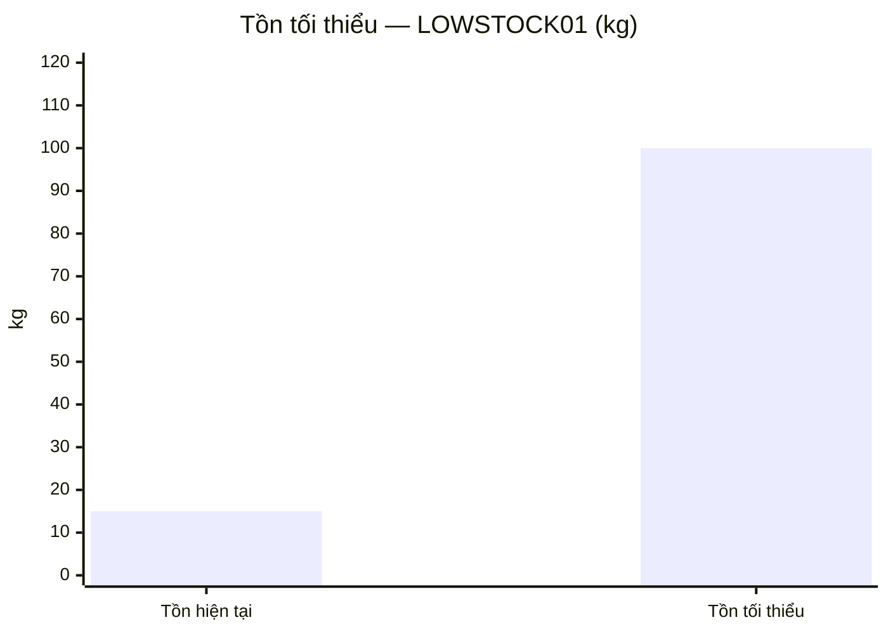
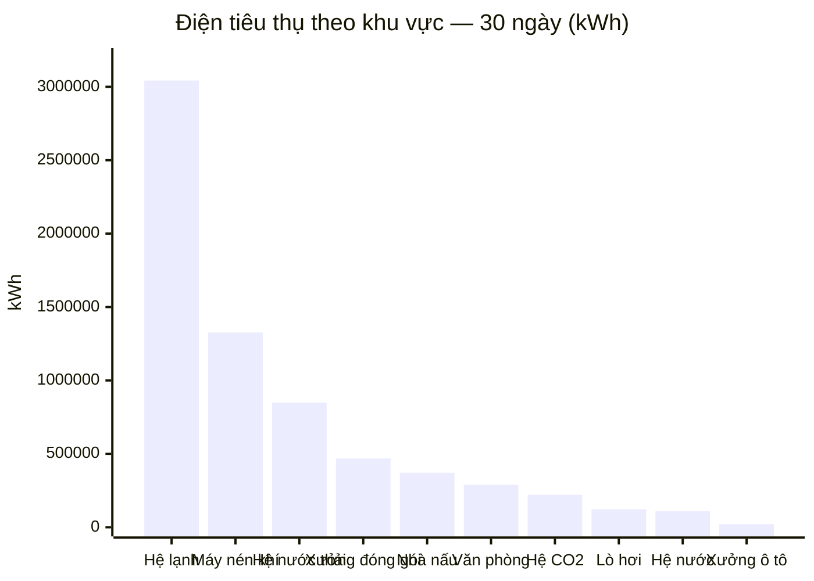
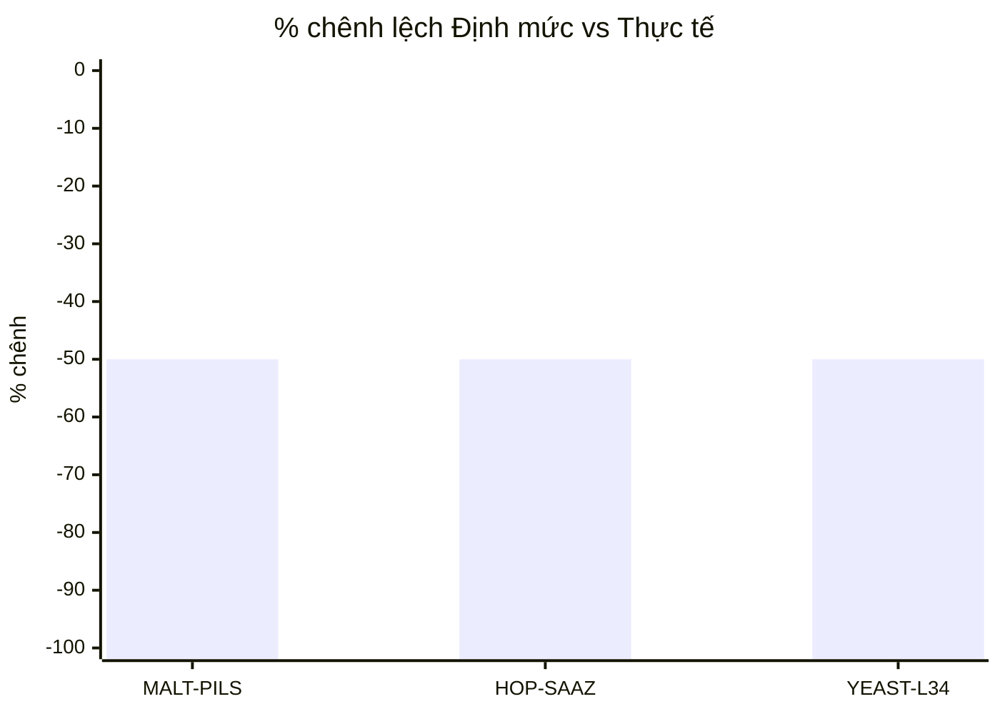

# Hướng dẫn sử dụng phần mềm MES Bia Hạ Long

**Nhà máy Đông Mai — Hệ thống điều hành sản xuất (Manufacturing Execution System)**

> Phiên bản phần mềm: `0.1.0-mvp` · Tài liệu cập nhật: **22/07/2026** (bản chạy lại buổi chiều), biên soạn bằng cách lấy trực tiếp dữ liệu và thao tác thật trên máy chủ đang chạy tại thời điểm này (không phải bản đề xuất/kế hoạch, không phải mô tả chung chung). Mỗi mục đều có: mục đích, ai dùng, các bước thao tác cụ thể (đúng tên trường/nút bấm thật), số liệu thật minh hoạ, và ở những chỗ phần mềm có vẽ biểu đồ, tài liệu vẽ lại đúng biểu đồ đó dạng Mermaid (`xychart-beta`) ngay từ số liệu thật — không phải ảnh chụp màn hình tĩnh. Mermaid hiển thị trực tiếp trên GitHub/GitLab và VS Code (cần bật extension Markdown Preview Mermaid Support); nếu trình xem không hỗ trợ, bảng số liệu ngay bên dưới mỗi biểu đồ vẫn đọc được bình thường.
>
> **Bổ sung sau ngày 22/07/2026** (mục 1 — danh sách tài khoản đúng theo sơ đồ tổ chức thật; mục 9.3 — trạng thái "Chờ duyệt" của mẻ lọc + cho phép trùng Batch/Order Number; mục 14 — toàn bộ phân hệ **CIP** mới; mục 21.1 — Danh mục Loại đơn vị tồn kho; mục 23 — nút **Xem** chi tiết audit): các mục này biên soạn từ đúng mã nguồn/cấu hình đang chạy (không chạy lại máy chủ để chụp số liệu thời điểm biên soạn), nên không kèm bảng "Dữ liệu thật hiện tại" như các mục cũ — các bước/tên trường/nút bấm vẫn đúng 100% với bản đang chạy.

---

## Mục lục

1. [Đăng nhập & tài khoản demo](#1-đăng-nhập--tài-khoản-demo)
2. [Tổng quan (Dashboard)](#2-tổng-quan-dashboard)
3. [Sơ đồ quy trình](#3-sơ-đồ-quy-trình)
4. [Lệnh sản xuất (Lệnh nấu / Lệnh lọc)](#4-lệnh-sản-xuất-lệnh-nấu--lệnh-lọc)
5. [Điều độ (Work Order)](#5-điều-độ-work-order)
6. [Lập lịch sản xuất](#6-lập-lịch-sản-xuất)
7. [Công thức (Formula/BOM)](#7-công-thức-formulabom)
8. [Chất lượng (QC) & QC Lab](#8-chất-lượng-qc--qc-lab)
9. [Nấu — Lọc — Chiết (công đoạn sản xuất chính)](#9-nấu--lọc--chiết-công-đoạn-sản-xuất-chính)
10. [Truy xuất nguồn gốc](#10-truy-xuất-nguồn-gốc)
11. [Kho NVL](#11-kho-nvl)
12. [Kho thành phẩm (WMS)](#12-kho-thành-phẩm-wms)
13. [Bao bì](#13-bao-bì)
14. [CIP — Vệ sinh thiết bị](#14-cip--vệ-sinh-thiết-bị)
15. [Năng lượng](#15-năng-lượng)
16. [OEE / Dừng máy](#16-oee--dừng-máy)
17. [Bảo trì / Kiểm định](#17-bảo-trì--kiểm-định)
18. [Báo cáo](#18-báo-cáo)
19. [Trợ lý AI](#19-trợ-lý-ai)
20. [Tích hợp (API/Webhook/Kết nối CSDL)](#20-tích-hợp-apiwebhookkết-nối-csdl)
21. [Danh mục (Master data)](#21-danh-mục-master-data)
22. [Tài khoản & phân quyền](#22-tài-khoản--phân-quyền)
23. [Audit — nhật ký hệ thống](#23-audit--nhật-ký-hệ-thống)
24. [Hồ sơ cá nhân](#24-hồ-sơ-cá-nhân)

---

## 1. Đăng nhập & tài khoản demo

**Mục đích:** xác thực người dùng, xác định vai trò/quyền thao tác cho mọi hành động tiếp theo.

**Các bước:**
1. Mở trình duyệt tới địa chỉ máy chủ (mặc định `http://localhost:8077` khi chạy tại chỗ).
2. Nhập **Tên đăng nhập** và **Mật khẩu** vào 2 ô trên màn hình đăng nhập, bấm **Đăng nhập**.
3. Hệ thống lưu token phiên vào trình duyệt — không cần đăng nhập lại cho tới khi bấm **Đăng xuất** (góc trên phải).
4. Muốn dùng trên tablet/màn hình cảm ứng ngoài xưởng: bấm **📱 Kiosk** (cạnh nút Đăng xuất) để mở giao diện rút gọn, tối ưu thao tác chạm.

**12 tài khoản demo đang có trên hệ thống** (mật khẩu mặc định `123456`, riêng `admin` là `admin123`) — danh sách đã rút gọn để khớp đúng sơ đồ tổ chức thật của nhà máy (không còn các chức danh "giám đốc nhà máy chung chung", "trưởng ca", "thủ kho phân xưởng", "bảo trì", "năng lượng" như trước — các việc đó đã gộp vào đúng chức danh thật bên dưới):

| Tài khoản | Vai trò (role) | Chức danh hiển thị | Dùng cho phần nào |
|---|---|---|---|
| `admin` | admin | Quản trị hệ thống | Toàn quyền, quản lý Tài khoản/Tích hợp |
| `quandoc` | supervisor | Quản đốc phân xưởng | Điều độ, duyệt kiểm kê, khai báo Danh mục, CIP |
| `phoquandoc` | supervisor | **Phó Quản đốc phân xưởng (trực ca)** — mới | Ký duyệt/khóa hồ sơ mẻ hàng ngày theo ca, CIP |
| `vanhanh` | operator | Nhân viên vận hành | Nấu/Lên men/Lọc/Chiết hàng ngày, khai báo CIP |
| `kcs` | qa | Nhân viên KCS / QA | Khai báo/duyệt QC, release lô, nghiệm thu CIP |
| `kysu` | engineer | Kỹ sư — Phòng Kỹ thuật, Công nghệ và Cải tiến Sản xuất | Công thức (soạn), cấu hình chỉ tiêu QC |
| `thukho` | operator | Thủ kho NVL | Nhập/xuất/kiểm kê Kho NVL |
| `kcs_truongphong` | qa | Trưởng phòng KCS | Khóa chỉ tiêu, tạo Lệnh lọc, duyệt QC |
| `giamdoc_sx` | supervisor | Giám đốc Sản xuất - Kỹ thuật | **Người duy nhất** duyệt lô chiết cho nhập Kho thành phẩm |
| `ttdh_thukhotp` | operator | NV Trung tâm Điều hành - Thủ kho TP | Quản lý Kho TP (WMS): xuất kho, điều chuyển, cất vị trí |
| `truongphong_kh` | supervisor | Trưởng phòng Kế hoạch | Duyệt điều chuyển Kho công ty → Nhà máy khác |
| `truongkho_tp` | supervisor | Trưởng bộ phận Kho thành phẩm | Xác nhận phiếu xuất kho TP + duyệt nhập kho từ chiết |

---

## 2. Tổng quan (Dashboard)

**Mục đích:** cho người quản lý (giám đốc/quản đốc/trưởng ca) nắm toàn cảnh nhà máy trong 1 màn hình duy nhất, không cần mở từng phân hệ.

**Ai dùng:** tất cả tài khoản — đây là màn hình mặc định sau đăng nhập.

### 2.1 Năm panel cảnh báo (đầu trang)

Trước đây là 1 bảng gộp, nay tách nhiều góc nhìn — 3 panel đầu dùng cùng 1 nguồn dữ liệu QC (1 lô có thể xuất hiện ở nhiều panel nếu thoả nhiều điều kiện), cộng thêm 2 panel cảnh báo vận hành mới:

| Panel | Điều kiện lọc | Cột hiển thị | Dữ liệu thật (22/07/2026) |
|---|---|---|---|
| 🚨 Cảnh báo QC | Có ≥1 chỉ tiêu QC đang **fail** | Lô/Phạm vi, Vật tư, SL, Chỉ tiêu fail | QCDEMO-LOT-01 — 1 chỉ tiêu fail |
| 🔒 Hold/Release | `MaterialLot.status = on_hold` | Lô/Phạm vi, Vật tư, SL, Trạng thái | QCDEMO-LOT-01 — Đang giữ |
| 📋 Deviation | Có deviation đang **mở** | Lô/Phạm vi, Vật tư, SL, Số lượng mở | Không có deviation nào đang mở |
| 📉 Sản lượng lọc thấp | Mẻ lọc dưới ngưỡng "Thấp" (Cài đặt vận hành, mục 21) trong N ngày gần nhất (chọn 3/5/7/14/30 ngày) | Mã lọc, Mẻ lọc số, Loại dịch bia, V bia (lít), Phân loại | — |
| ⏳ Đã chiết chưa duyệt | Mẻ chiết đã **Kết thúc chiết** nhưng Giám đốc Sản xuất - Kỹ thuật chưa **Duyệt** nhập Kho TP | Mã chiết, Sản phẩm, Loại bia, Chờ (giờ) | — |

Mỗi panel tự ẩn nội dung, hiện dòng "Không có ... nào" khi rỗng. Bấm 1 dòng bất kỳ trong 3 panel QC đầu để nhảy tới Chất lượng; bấm dòng ở 2 panel sau để nhảy thẳng tới đúng sub-tab Lọc/Chiết trong Nấu-Lọc-Chiết.

### 2.2 Lệnh & mẻ sản xuất (6 ô số liệu)

| Ô | Số liệu thật | Chi tiết |
|---|---|---|
| 🍺 Lệnh nấu | 1 | 1 hoàn thành · 0 đang thực hiện · 0 chưa thực hiện |
| 🧪 Lệnh lọc | 2 | 2 hoàn thành · 0 đang thực hiện · 0 chưa thực hiện |
| 🔥 Mẻ nấu | 5 | 5 hoàn thành · 0 đang thực hiện |
| 🛢️ Tank đang lên men | 2/4 | 2 tank trống |
| 🧊 Mẻ lọc | 3 | 3 hoàn thành · 0 đang thực hiện |
| 🥤 Mẻ chiết | 4 | 2 hoàn thành · 2 đang thực hiện |

Bấm vào 1 ô để nhảy thẳng tới đúng sub-tab liên quan (ví dụ bấm "Mẻ nấu" mở thẳng tab Nấu trong Nấu-Lọc-Chiết).

### 2.3 Hai biểu đồ tank đang lên men

Ngay dưới 6 ô số liệu, 2 panel cạnh nhau cùng dữ liệu tank đang lên men (nhóm theo dịch bia, sắp theo số ngày quá hạn giảm dần trong từng nhóm), 4 mức màu theo số ngày lên men thật so ngày lên men chuẩn (Đang lên men/Sắp đủ ngày/Đã đủ ngày/Quá hạn) — có chấm đỏ số chỉ tiêu CT chính/phụ đang fail trên tank đó, bấm vào chấm để xem chi tiết:

- **🍺 Theo số ngày (thanh ngang)** — mỗi dòng 1 tank, thanh thể hiện số ngày đã lên men/số ngày chuẩn.
- **🧊 Theo giai đoạn (lưới ô màu)** — mỗi ô = 1 tank, tô màu theo giai đoạn.

Bấm nút **Nấu-Lọc-Chiết › Lên men** ở đầu panel để xem đầy đủ tại mục 9.2.

### 2.4 Hai biểu đồ cảnh báo tồn kho

- **📦 Tồn kho thành phẩm cần chú ý (theo tuổi lô)** — biểu đồ cột, 3 ngưỡng màu Chú ý (≥0.7 ngày)/Cảnh báo (≥0.9 ngày)/Nghiêm trọng (≥30 ngày). Dữ liệu thật: 0 lô mức Chú ý, **27 keg + 46 lon + 300.048 vỉ** ở mức Cảnh báo (FLGN200 lô 1: 27 keg/1,43 ngày; CSPS330 lô 2: 46 lon + 300.048 vỉ/1,24 ngày), 0 lô Nghiêm trọng. Bấm nút **Kho TP › Tồn kho theo tuổi** để xem đầy đủ (biểu đồ giống hệt, xem mục 12.8).

  ```mermaid
  xychart-beta
      title "Tồn kho thành phẩm theo tuổi (ngày) — mức Cảnh báo"
      x-axis ["FLGN200 lô 1 (keg)", "CSPS330 lô 2 (lon)", "CSPS330 lô 2 (vỉ)"]
      y-axis "Số ngày tồn kho" 0 --> 2
      bar [1.43, 1.24, 1.24]
  ```

- **⏰ Nguyên vật liệu sắp/đã hết hạn** — biểu đồ cột âm/dương quanh mốc "hôm nay" (âm = đã quá hạn, dương = còn lại bao nhiêu ngày). Dữ liệu thật (loại trừ MALT-VIENNA·MALT-V-2406-01 còn 166 ngày, chưa tới ngưỡng cảnh báo) — chi tiết 8 lô xem mục 11.5. Bấm **Kho NVL › Hạn sử dụng** để xem đầy đủ.

  ```mermaid
  xychart-beta
      title "NVL sắp/đã hết hạn (số ngày còn lại)"
      x-axis ["GAO-504·001", "002·002", "GAO-504·KCS02", "MALT-ANH·KCS03", "GAO-504·KCS", "002·2026-00017", "MALT-PILS·KCS01"]
      y-axis "Số ngày (âm = quá hạn)" -15 --> 10
      bar [-13, -6, -1, 0, 7, 7, 8]
  ```

### 2.5 Số liệu SCADA thật (không giả lập)

- **🍺 Sản lượng chiết 5 ngày gần nhất** — Bia lon: nhà máy Đông Mai (nguồn `30K_Report`); Bia keg: nhà máy Hạ Long (nguồn `Donggoi`). Mỗi ngày 3 cột Ca 1/2/3.
- **⚡ Điện tiêu thụ 5 ngày gần nhất** — nguồn bảng Energy/NameSys qua kết nối CSDL gán "Dùng cho: Năng lượng — Hạ Long".

### 2.6 Audit gần đây & Mẻ gần đây

2 bảng cuối trang. Dữ liệu thật audit gần nhất (seq #590-595): 2 lượt `login` của `admin`, xen giữa là `relocate_batch` (chuyển 1 keg FLGN200 lô 1 vào vị trí KH01 — đúng thao tác Cất vào vị trí mới thêm, mục 12.5), và `post`/`undo` của `stock_count` KK-260722-EE2D (lệch MALT-2406-01: 3802↔3810kg) — đúng chuỗi thao tác kiểm kê vừa kiểm thử trước đó trong ngày.

---

## 3. Sơ đồ quy trình

**Mục đích:** giúp nhân viên mới hoặc khách tham quan hiểu luồng nghiệp vụ trong vài phút.

Sơ đồ dạng chuỗi khối bấm được (không phải ảnh SVG tĩnh) gồm **13 bước** theo đúng thứ tự thực hiện: Kho NVL → Lệnh SX (kèm số lệnh nấu/lọc thật) → Điều độ → Mẻ sản xuất → Cấp liệu → Mẻ nấu → Lên men chính → Lên men phụ → Lọc → Chiết → Thành phẩm → Chất lượng (kèm số lô đang HOLD nếu có) → Kho TP (WMS). Bấm vào 1 khối để mở thẳng đúng tab/sub-tab nghiệp vụ tương ứng; các bước "Điều độ" và "Mẻ sản xuất" hiện gắn nhãn **"Tạm thời chưa dùng"** vì quy trình thật hiện tạo mẻ trực tiếp ở Nấu-Lọc-Chiết. Dưới chuỗi chính là khối riêng **🔎 Truy xuất nguồn gốc** (bấm để mở, không có ô nhập mã lô ngay trên sơ đồ) và hàng chip dữ liệu nền: Công thức, Công thức+, ISA-88, Lập lịch, Bao bì.

---

## 4. Lệnh sản xuất (Lệnh nấu / Lệnh lọc)

**Mục đích:** quản lý kế hoạch sản xuất cấp cao trước khi phát sinh mẻ thực tế.

**Ai dùng:** trưởng ca/quản đốc (tạo lệnh), vận hành (chọn lệnh khi tạo mẻ ở mục 9).

**3 sub-tab:** Lệnh nấu · Lệnh lọc · Lệnh SX (ERP).

### 4.1 Lệnh nấu (Brew Master Order)

**Các bước tạo:**
1. Vào **Lệnh SX**, chọn sub-tab **Lệnh nấu**.
2. Nhập thông tin lệnh lớn: **Số lệnh** (VD `36/PXSXBĐM-T6/2026`), Người ra lệnh, Đơn vị thực hiện, Thủ kho, Căn cứ, Thời gian bắt đầu/kết thúc, Biện pháp an toàn.
3. Bấm **+ Thêm lệnh nấu nhỏ** để thêm 1 hoặc nhiều **lệnh nấu nhỏ** vào cùng lệnh lớn — mỗi lệnh nhỏ chọn **Dịch bia**, nhập **Số mẻ kế hoạch**, **Sản lượng nấu kế hoạch (hl)**, **Sai số cho phép (±hl)**. Bấm **📋 Xem NVL (đủ/thiếu tồn)** để xem trước định mức NVL đã scale theo Công thức đang dùng (nạp tự động theo Dịch bia đã chọn, hiện cả tồn Kho công ty và Kho phân xưởng).
4. Bấm **Tạo lệnh nấu** — hệ thống tạo lệnh lớn (master) gồm các lệnh nhỏ bên trong.
5. Khi tạo mẻ nấu (mục 9.1), bắt buộc chọn đúng 1 lệnh nấu nhỏ **chưa hoàn thành** — mỗi mẻ chạy xong tự cộng dồn vào % hoàn thành của lệnh nhỏ đó (theo thể tích thực tế/kế hoạch, ±sai số cho phép), tới khi đạt thì lệnh nhỏ không chọn được nữa.
6. Bấm **Xem** để xem chi tiết, **🖨️ In** để xuất biểu mẫu giấy đúng layout thực tế nhà máy (in chung 1 tờ gồm tất cả lệnh nhỏ). **Sửa**/**Xóa** chỉ hiện khi lệnh **chưa có mẻ nấu nào thực hiện**.

Lệnh tự khoá khi toàn bộ lệnh nhỏ bên dưới đã hoàn thành — không có nút khoá riêng ở cấp lệnh lớn.

### 4.2 Lệnh lọc (Filter Master Order → Filter Order)

**Các bước tạo:**
1. Sub-tab **Lệnh lọc**, nhập **Số lệnh** + **Ghi chú** (tuỳ chọn), bấm **+ Thêm lệnh lọc nhỏ** để thêm 1 hoặc nhiều **lệnh lọc nhỏ**.
2. Mỗi lệnh lọc nhỏ chọn chế độ **Không phối** (1 tank nguồn) hoặc **Phối** (2+ tank, phải cùng 1 dịch bia) — mỗi tank chọn nguồn là **Tank lên men** (CCT đã Duyệt LM) hoặc **Tank thành phẩm (BBT) — lọc lại** (bắt buộc nhập **Lý do lọc lại**), và **Thể tích dịch lọc KH (hl)** riêng cho từng tank. Hệ thống hiện ngay lượng CCT/BBT còn khả dụng sau khi trừ phần các lệnh nhỏ phía trên đã đặt trước, chống cam kết vượt tồn thật của tank.
3. **Loại bia** của lệnh nhỏ tự suy ra từ dịch bia của (các) tank đã chọn; nếu các tank thuộc nhiều Loại bia khác nhau, hệ thống bắt buộc tự chọn 1 Loại bia cho lệnh nhỏ.
4. Có thể khai báo thêm **Vật tư sử dụng** (tuỳ chọn, ví dụ bột trợ lọc Diatomite) — gõ để tìm vật tư hoặc Nhóm vật tư thay thế, nhập Số lượng cần để xem ngay tồn FIFO Kho công ty/Kho phân xưởng (và cảnh báo thiếu nếu vượt tồn).
5. Nhập **Số lô KCS**, chọn **Sản phẩm** đích (tuỳ chọn — kế thừa xuống mẻ lọc thật khi thực hiện).
6. Bấm **Tạo lệnh lọc**. Khi tạo mẻ lọc (mục 9.3), chọn đúng Lệnh lọc nhỏ này để thực hiện — sản lượng cộng dồn tới khi đạt thể tích kế hoạch (±sai số) thì không chọn được nữa.

### 4.3 Lệnh SX (ERP)

Sub-tab đơn giản, độc lập với Lệnh nấu/Lệnh lọc — dùng khi cần lệnh sản xuất tổng quát chưa gắn chi tiết dịch bia/tank: nhập **Mã lệnh**, chọn **Sản phẩm**, **SL kế hoạch**, **ĐVT**, **Ưu tiên**, bấm **Tạo lệnh**. Xem lại ở bảng **Danh sách lệnh** (có tìm kiếm).

**Dữ liệu thật hiện tại:** 1 Lệnh nấu, 2 Lệnh lọc — cả 3 đều đã hoàn thành 100%.

---

## 5. Điều độ (Work Order)

**Mục đích:** lập kế hoạch ngày/ca/dây chuyền tách bạch với thực tế chạy, rồi phát sinh mẻ đúng công thức đã duyệt (tránh nhập tay sai).

**Ai dùng:** trưởng ca (tạo/điều hành Work Order — quyền `wo.manage`; phát mẻ — quyền `wo.dispatch`).

> Ghi chú: đây là cơ chế Work Order dựa trên **Lệnh SX (ERP)** + **Recipe version** kiểu cũ, tách biệt với Lệnh nấu/Lệnh lọc (mục 4) đang dùng thật hàng ngày — trên Sơ đồ quy trình (mục 3), 2 bước "Điều độ" và "Mẻ sản xuất" hiện gắn nhãn **"Tạm thời chưa dùng"** vì quy trình thật hiện tạo mẻ trực tiếp ở Nấu-Lọc-Chiết (mục 9) theo Lệnh nấu/Lệnh lọc, không đi qua Work Order.

**Các bước:**
1. Vào **Điều độ**, bấm **Tạo lệnh (wo.manage)** — chọn **Lệnh ERP (PO)**, **Recipe version** (chỉ hiện version đã `effective` của sản phẩm thuộc PO đó), SL kế hoạch (mặc định theo PO), Dây chuyền, Ca, Ngày, Ưu tiên.
2. Lệnh mới tạo ở trạng thái **Lập KH** (planned) — bấm **Phát hành** để chuyển sang **Đã phát hành** (released), công bố cho ca sản xuất; hoặc bấm **Hủy** nếu không cần nữa.
3. Khi đã **Đã phát hành** (hoặc **Đang chạy**): bấm **⮞ Phát mẻ** để tự động tạo mẻ theo đúng Work Order + Recipe version đã chọn — nếu thiếu tồn kho, hệ thống báo lỗi và hỏi xác nhận **"Vẫn phát mẻ (ghi nhận thiếu)?"** trước khi cho phát mẻ thiếu tồn.
4. Khi lệnh đã **Hoàn thành**, bấm **Chốt** để khoá vĩnh viễn — không còn chuyển trạng thái được nữa.
5. Cột **% HT** = tổng SL thực tế các mẻ thuộc lệnh / SL kế hoạch.

**Dữ liệu thật hiện tại:** 8 Work Order đang có trong hệ thống.

---

## 6. Lập lịch sản xuất

**Mục đích:** sắp xếp thứ tự nấu/lọc/chiết theo ràng buộc dây chuyền/tank sẵn có, tránh 2 mẻ cùng đòi 1 tank cùng giờ.

**Ai dùng:** trưởng ca.

**Các bước:**
1. Vào **Lập lịch**, nhập **Số ngày** hiển thị (mặc định 12), xem lịch dạng lane theo từng tank (ví dụ FV-01, FV-02, FV-03, FV-04).
2. Mỗi lane hiện các khối màu theo 4 loại: 🟦 `production` (mẻ sản xuất, gắn mã Work Order + sản phẩm), 🟧 `cip` (vệ sinh giữa mẻ), 🟥 `maintenance` (bảo trì), 🔴 **Thiếu NVL** (khối sản xuất tô đỏ đậm riêng khi thiếu tồn theo BOM — đưa chuột vào khối để xem tooltip chi tiết).
3. Bấm **⚙️ Tự lập lịch tối ưu** để hệ thống tự sắp xếp thứ tự tối ưu, tự chèn khối CIP giữa 2 mẻ liên tiếp trên cùng 1 tank.
4. Panel **⚠️ Xung đột & cảnh báo** bên dưới tự liệt kê 2 loại vấn đề nếu có: lịch **chồng lấn** trên cùng 1 tank/dây chuyền, và Work Order **thiếu NVL** theo BOM — hiện "Không có xung đột — lịch khả thi" khi lịch sạch.

**Dữ liệu thật hiện tại (ví dụ tank FV-01):** WO-2406-002 (BIA-LAGER, planned, 22/7 → 24/7) → CIP giữa mẻ (24/7, 4 giờ) → WO-2406-007 (BIA-LAGER, planned, 24/7 → 26/7). Tank FV-02 có khối bảo trì "Bảo trì van đáy FV-02" (11/7, 12 giờ) xen giữa các mẻ sản xuất.

---

## 7. Công thức (Formula/BOM)

**Mục đích:** quản lý định mức NVL (BOM) theo từng dịch bia, tự động scale theo sản lượng — mô hình mới **Formula**, thay cho Recipe/RecipeVersion version-hóa 6 trạng thái trước đây (mỗi lần đổi định mức = tạo 1 công thức MỚI, không sửa/thêm version vào công thức cũ).

**Ai dùng:** quyền `recipe.author` — dùng CHUNG cho mọi thao tác (tạo/sửa/kích hoạt/khóa/xóa), không còn tách riêng người soạn/người duyệt (Segregation of Duties cũ đã bỏ ở mô hình này).

Màn hình liệt kê **1 panel/dịch bia** (Sản phẩm) — mỗi panel có bảng công thức riêng + lịch sử kích hoạt riêng.

**Các bước tạo công thức mới:**
1. Vào **Công thức**, ở panel của đúng Dịch bia cần soạn, bấm **+ Tạo công thức mới**.
2. Nhập **Mã công thức**, **Quy mô mẻ chuẩn** + **ĐVT** (`base_qty`/`base_uom` — sản lượng gốc dùng để tính định mức), **Ghi chú**.
3. Soạn **Nguyên vật liệu**: bấm **+ Thêm dòng NVL** — ô Vật tư là kiểu **gõ để tìm** (không phải danh sách sổ xuống dài), chỉ gợi ý vật tư thuộc Nhóm vật tư được đánh dấu "Nguyên liệu"; có thể chọn 1 **Nhóm vật tư thay thế** (mục 21) thay cho 1 mã vật tư cụ thể khi nhiều mã tương đương nhau có thể dùng thay nhau. Không còn cột dung sai % (đã bỏ so với BOM/RecipeVersion cũ) — ĐVT tự khoá theo vật tư/nhóm đã chọn, không sửa tay.
4. Bấm **Tạo công thức** để lưu — công thức mới lưu ở trạng thái **chưa hiệu lực** (chưa activate), không tự thay công thức đang dùng.
5. Bấm **Kích hoạt** để đưa công thức này thành công thức **đang hiệu lực** của dịch bia — hệ thống tự **Ngừng hiệu lực** công thức đang hiệu lực cũ (chỉ 1 công thức/dịch bia được hiệu lực tại 1 thời điểm); bấm **Ngừng hiệu lực** để tắt mà chưa cần công thức khác thay ngay.
6. Bấm **🔒 Khóa** khi công thức đã ổn định để chặn sửa vĩnh viễn (bấm **🔓 Mở khóa** để mở lại); **🗑 Xóa** chỉ hiện với công thức **chưa hiệu lực và chưa khóa**.
7. Bấm **Xem NVL** để xem lại toàn bộ dòng định mức của 1 công thức bất kỳ (không cần vào chế độ sửa).

Bên dưới bảng công thức của mỗi dịch bia có bảng **Lịch sử kích hoạt** (FormulaActivationLog) — 3 lần gần nhất: thời gian, hành động (🟢 Kích hoạt/⚪ Ngừng hiệu lực), công thức, người thực hiện, ghi chú.

Khi tạo mẻ nấu (mục 9.1) hoặc Lệnh nấu (mục 4.1), BOM tự động **scale theo sản lượng kế hoạch** = định mức × (SL kế hoạch / base_qty), rồi **chụp snapshot bất biến** vào mẻ — sửa/kích hoạt công thức khác sau này không ảnh hưởng ngược mẻ đã chạy.

> Ghi chú: nav còn 1 mục **"Công thức+"** (dimmed trên thanh menu) mang các công cụ cũ (Hiệu suất theo công đoạn, Kiểm soát thay đổi công thức/change-control, Ký duyệt e-signature, Kiểm tra tồn & nguyên liệu thay thế) — các công cụ này vẫn thao tác trên mô hình **Recipe/RecipeVersion cũ** (`/api/recipes`), giữ lại riêng để không mất lịch sử change-control/e-signature cũ, **không liên quan tới dữ liệu Công thức (Formula) đang dùng thật ở mục 7 này**.

**Dữ liệu thật hiện tại:** 3 công thức đang có trong hệ thống.

---

## 8. Chất lượng (QC) & QC Lab

**Mục đích:** kiểm soát chất lượng theo GMP — mọi lô có chỉ tiêu fail đều tự động bị chặn, không phụ thuộc trí nhớ con người.

**Ai dùng:** KCS/QA (ghi kết quả — bất kỳ role qa; release — quyền `quality.release`, tách biệt với người ghi).

### 8.1 Chất lượng — khai báo/duyệt

Đầu trang có 2 panel "chờ xử lý" luôn hiện trước để không bị bỏ sót: **🔬 Lô NVL chờ khai báo/duyệt chỉ tiêu chất lượng** (lô NVL nhập kho có gán nhóm chỉ tiêu bắt buộc, bấm **Khai báo / Duyệt** trên dòng lô) và **🧪 Công đoạn chờ khai báo chỉ tiêu chất lượng** (mẻ nấu/lô lên men/mẻ lọc/mã chiết có gán nhóm chỉ tiêu bắt buộc nhưng chưa khai báo đủ — cột "Chỉ tiêu còn thiếu" liệt kê rõ tên chỉ tiêu, bấm **Khai báo** để nhảy thẳng tới đúng công đoạn).

**Các bước ghi kết quả 1 chỉ tiêu:**
1. Vào **Chất lượng**, chọn đối tượng cần kiểm ở 1 trong 2 panel chờ xử lý trên, hoặc xử lý trực tiếp ở đúng công đoạn (Nấu/Lên men/Lọc/Chiết trong mục 9, hoặc Kho NVL mục 11).
2. Nhập kết quả từng chỉ tiêu trong nhóm chỉ tiêu QC đã gán sẵn cho vật tư/công đoạn/sản phẩm đó — pass hoặc fail.
3. Nếu có chỉ tiêu fail: lô/phạm vi **tự động chuyển on_hold**, xuất hiện ngay trên Dashboard (mục 2.1).
4. Ở panel **Hold / Release**: chọn **Phạm vi** cần thao tác (gõ để tìm nhanh — dropdown tách 2 nhóm "⚠ Đang FAIL chỉ tiêu" và "Không FAIL", quét cả 6 loại phạm vi Mẻ SX/Nấu/Lên men/Lọc/Chiết/NVL), hệ thống hiện ngay chỉ tiêu đã khai báo của phạm vi đó. Bấm **HOLD (qa/supervisor)** để giữ thêm — **bắt buộc nhập Lý do HOLD**; hoặc **RELEASE (qa)** để giải phóng khi đã xử lý xong (ví dụ đóng deviation) — **bắt buộc nhập Lý do RELEASE**, và bị chặn nếu phạm vi còn chỉ tiêu FAIL chưa đóng deviation. Cả 2 thao tác đều lưu vào **Lịch sử Hold/Release** bên dưới (có tìm kiếm).
5. Nếu cần mở deviation (điều tra sự cố chất lượng): mục **Mở deviation**, chọn Phạm vi, chọn **Mức** (minor/major/critical), nhập **Lý do**, bấm **Mở** — deviation mở sẽ tự động giữ lô luôn (không cần bấm hold riêng), và xuất hiện ở panel Deviation trên Dashboard cho tới khi đóng.
6. Bảng **Kết quả QC gần đây** gộp theo mẻ/lô nguồn (1 dòng/công đoạn, không lặp theo từng chỉ tiêu) — bấm **Xem chi tiết** để xem từng chỉ tiêu. Bảng **Deviations** liệt kê deviation đang mở, kèm cột Chỉ tiêu không đạt liên quan.

**Dữ liệu thật hiện tại:** 3 deviation đang có trong hệ thống (0 đang mở tại thời điểm biên soạn — panel Deviation trên Dashboard đang trống).

### 8.2 QC Lab — SPC, CAPA & LIMS

Theo dõi **độc lập** với luồng hold ở mục 8.1 (không tự động giữ lô). **4 khối:**

1. **📈 SPC — Biểu đồ kiểm soát** — chọn 1 **Chỉ tiêu**, hệ thống vẽ control chart (UCL/LCL, đường trung tâm) từ các kết quả QC đã ghi, kèm n/Mean/σ/UCL/LCL và năng lực quá trình **Cp/Cpk**, badge "trong kiểm soát" hoặc số điểm vi phạm nếu có.
2. **🛠️ CAPA** (Corrective/Preventive Action) — bấm **+ Mở CAPA** (nhập Tiêu đề, chọn Loại: Khắc phục/Phòng ngừa) để ghi hành động khắc phục/phòng ngừa cho sự cố lặp lại. Bấm **Chi tiết** từng CAPA để xem/nhập **Nguyên nhân gốc**, **Kế hoạch hành động**, **Hiệu lực (verification)**, rồi bấm nút chuyển trạng thái theo đúng 4 bước vòng đời: `open → investigation → action → verification → closed` (nút hiện đúng bước kế tiếp, không nhảy cóc).
3. **📄 COA** (Certificate of Analysis) — chọn **Mẻ**, bấm **Xuất COA** — hiện toàn bộ chỉ tiêu/giá trị/giới hạn/kết quả pass-fail của mẻ đó kèm kết luận tổng **PASS/FAIL**, cảnh báo riêng nếu còn **thiếu chỉ tiêu bắt buộc**.
4. **🧫 LIMS — Phiếu mẫu** — chọn Mẻ + Công đoạn, bấm **+ Đăng ký mẫu** để tạo phiếu mẫu gửi phòng thí nghiệm; bấm **Bắt đầu test**/**Hoàn thành** trên từng dòng mẫu để chuyển trạng thái (registered → in_test → completed).

**Nguyên tắc quan trọng:** người ghi kết quả QC ≠ người release lô (Segregation of Duties, chuẩn GMP).

---

## 9. Nấu — Lọc — Chiết (công đoạn sản xuất chính)

**Mục đích:** module lõi, theo đúng chuỗi vật lý nhà máy bia. Có **8 sub-tab**: Nguyên liệu · Nấu · Lên men · Lọc · Chiết · Cảnh báo chỉ tiêu · Hóa chất · Thu hồi men.

**Ai dùng:** nhân viên vận hành (tạo/kết thúc mẻ), KCS (duyệt các cổng chặn QC), kỹ sư (theo dõi).

### 9.0 Nguyên liệu

Sub-tab đầu tiên — bảng tồn kho NVL **theo kho** (chọn Kho công ty/Kho phân xưởng/Tất cả), mỗi mã vật tư hiện kèm các mã lô còn tồn (badge "CHỜ QC" nếu lô đang on_hold), dùng để tra nhanh tồn trước khi cấp liệu cho mẻ — nguyên liệu phân bổ vào mẻ nấu (nút **+ NVL**, xem mục 9.1) luôn lấy từ **Kho phân xưởng**.

### 9.1 Nấu

**Các bước tạo 1 mã nấu + mẻ:**
1. Sub-tab **Nấu**, ở panel **Thêm thông tin nấu**: chọn **Lệnh nấu** rồi chọn đúng **Lệnh nấu nhỏ** (chưa hoàn thành, xem mục 4.1) — **Dịch bia** tự lấy theo lệnh nhỏ đã chọn (chỉ sửa tay khi lệnh nhỏ chưa gắn dịch bia). Nhập **Mã nấu**, **Ngày nấu**, **SL nấu/hl**, chọn **Tank lên men** (chỉ hiện tank đang trống) + **Men sử dụng**, bấm **Thêm** — tạo 1 "mã nấu" (1 lần nấu vào 1 tank).
2. Bấm nút **Mẻ (N)** trên dòng mã nấu vừa tạo để mở modal các mẻ cụ thể bên trong — bấm **+ Thêm mẻ**, nhập **Mã mẻ** (số mẻ Braumat, số nguyên dương duy nhất trong năm, VD 123), chọn **Dây chuyền nấu**, **Giờ bắt đầu**, Ghi chú.
3. Trên mỗi dòng mẻ: bấm **+ NVL** để ghi nhận NVL đã dùng (gợi ý theo BOM công thức + FIFO lô còn tồn ở Kho phân xưởng, tự cảnh báo nếu chọn lô không phải lô cũ nhất; từ mẻ thứ 2 trở đi có thể bấm **Xem gợi ý** để copy nhanh danh sách NVL từ mẻ đầu). Bấm **Ghi chép nấu** để nhập checkpoint nhiệt độ/thời gian theo biểu mẫu QT-KCS-QT-BM-05, hoặc **Import Step Protocol (PDF, có thể chọn nhiều file)** — hệ thống tự parse log Braumat, xem lại ở tab con "Dữ liệu Braumat đã import" (có thể **Xuất CSV**), bấm **🖨️ In biểu mẫu** để in.
4. Khi xong: bấm **Kết thúc** trên dòng mẻ, nhập giờ kết thúc thật (không tự động lấy giờ hệ thống).
5. Người có quyền `quality.release` bấm **Khóa lô** trên dòng mã nấu khi hồ sơ đã hoàn tất, chặn sửa/xóa ngược; admin có thể **Mở khóa** lại khi cần.

Bảng Nấu tô màu theo trạng thái chỉ tiêu: Đỏ = thiếu chỉ tiêu bắt buộc hoặc có chỉ tiêu FAIL, Xanh lá = đủ chỉ tiêu nhưng còn mẻ chưa nhập NVL, Xanh dương = tất cả mẻ đầy đủ.

### 9.2 Lên men

Tank & lô LM được gán ngay lúc tạo mã nấu (mục 9.1) — 1 tank có thể nhận nhiều mẻ nấu; tab này chỉ dùng để xem và khai báo chỉ tiêu lên men, không tạo mới lô LM ở đây. Bảng hiện: Ngày nấu/Ngày KT, **Số ngày đã lên men** (dạng ngày.giờ.phút / số ngày chuẩn), Đang tồn CCT/hl, Trạng thái (Đang nấu/Đang lên men/Lọc 1 phần/Lọc hết), và cột **Sẵn sàng chiết** báo "Đủ N ngày — chờ KCS duyệt" khi đã tới hạn.

**Các bước:**
1. Sub-tab **Lên men**, trên dòng tank đang có dịch, bấm **Ghi chép LM** để mở biểu mẫu **BM 1.11 (06)** — nhập bảng thông tin đầu + **bảng theo ngày** (nhiệt độ/°S/mật độ tế bào) + các mốc **"Hạ phụ"**; hệ thống tự vẽ biểu đồ theo dõi lên men từ số liệu đã nhập. Import Braumat cho lên men hiện **chưa hỗ trợ** (chưa có định dạng mẫu). Có thể bấm **🖨️ In biểu mẫu**.
2. Khai báo chỉ tiêu QC lên men qua 2 nút riêng trên mỗi dòng: **CT chính** và **CT phụ** (2 nhóm chỉ tiêu độc lập).
3. Khi đã đủ ngày lên men chuẩn và chỉ tiêu QC lên men đạt: KCS (quyền `quality.release`) bấm **Duyệt LM (KCS)** — đây là cổng chặn bắt buộc, chưa duyệt thì tank không xuất hiện trong danh sách chọn tank nguồn ở Lệnh lọc (mục 4.2) lẫn tạo mẻ lọc (mục 9.3).
4. Có thể bấm **CIP** trên dòng để gắn liên kết các lần vệ sinh tank này (mục 14.5), hoặc **Làm rỗng tank** để buộc tồn CCT về 0 khi tank vật lý đã lọc cạn thật nhưng số liệu hệ thống còn lệch.
5. Người có quyền `quality.release` bấm **Khóa lô** khi hồ sơ đã hoàn tất.

### 9.3 Lọc

**Các bước tạo 1 mẻ lọc:**
1. Sub-tab **Lọc**, panel **Thêm thông tin lọc (Lọc thường)** dùng để thêm mẻ vào tank BBT **MỚI** (chưa có mẻ nào) — tank BBT đã có mẻ thì bấm nút **Tank (N)** trên dòng mẻ đó rồi **+ Thêm mẻ** trong đó (tự dùng lại đúng tank nguồn của mẻ, không chọn lại).
2. Chọn **Lệnh lọc** rồi **Lệnh lọc nhỏ** (mục 4.2, chưa dùng hết) — tank nguồn (CCT hoặc BBT tái lọc) kế thừa từ lệnh nhỏ đã chọn, không chọn lại ở đây; **Loại bia** tự hiện theo lệnh nhỏ. Chọn **Cho vào Tank BBT** (tank đích) — chỉ hiện tank BBT đang trống (không bị lệnh khác chiếm dụng hoặc còn dịch đã qua duyệt KCS). Bấm **Thêm** — mã lô lọc tự sinh; **Dịch nha lọc**/**Nước bài khí** chưa cần điền ngay, điền khi bấm "Kết thúc" từng tank.
3. Chỉ các tank lên men đã **Duyệt LM** (mục 9.2) mới xuất hiện trong danh sách chọn làm tank nguồn.
4. Theo dõi thể tích dịch còn lại từng tank (cột "Đang tồn/hl") ngay trên bảng.
5. Khi rút dịch xong 1 tank: bấm **Kết thúc** trên dòng tank đó, nhập **Mẻ lọc số**, **Số mẻ (Batch number Brewmax)**, **Số lệnh (Order number Brewmax)** đúng theo phiếu giấy, **Dịch nha lọc (hl)** (bắt buộc > 0) và **Nước bài khí (hl)** — **V Bia/hl** tự tính = Dịch nha lọc + Nước bài khí, không nhập tay. Số mẻ/số lệnh **được phép trùng** giữa các lệnh lọc khác nhau (ví dụ khi nhà máy reset số theo ca/ngày) — hệ thống không còn báo lỗi trùng (chỉ hỏi lại xác nhận nếu "Mẻ lọc số" trùng với 1 mẻ khác TRONG CÙNG lệnh lọc, để bắt lỗi gõ nhầm), báo cáo sản lượng tự gộp đúng theo bộ 3 giá trị này khi tính mẻ lọc thật.
6. KCS bấm **Duyệt KCS** sau khi lọc đạt (chỉ hiện khi tank đã lọc xong — kết thúc hết các tank nguồn của mẻ đó) — tank chưa duyệt sẽ bị chặn khỏi danh sách chọn ở bước Chiết.
7. Có thể bấm **Chỉ tiêu** để khai báo chỉ tiêu QC sau lọc, **CIP** để gắn liên kết vệ sinh tank (mục 14.5), **Làm rỗng tank** khi số liệu tồn BBT lệch với tank vật lý đã chiết cạn, và **Khóa lô** (quyền `quality.release`) khi hồ sơ hoàn tất.

**Trạng thái 1 dòng lọc hiển thị trên bảng** (tự suy ra từ tồn BBT thật, không phải cột cố định): **Đang lọc** (chưa bấm Kết thúc) → **Chờ duyệt** (đã Kết thúc nhưng KCS chưa Duyệt KCS — CHƯA được đem đi chiết dù đã rút hết dịch) → **Chờ chiết** (đã Duyệt KCS, chưa chiết giọt nào) → **Đang chiết** (đã chiết một phần) → **Đã chiết hết** (tồn BBT về 0).

### 9.4 Chiết

**Các bước:**
1. Sub-tab **Chiết**, panel **Thêm thông tin chiết** — chọn **Chiết từ tank BBT** (chỉ hiện tank đã lọc xong hết + Duyệt KCS ở bước Lọc, và không đang bị chọn làm nguồn "lọc lại" của lệnh lọc khác) — **Loại bia** tự hiện theo tank đã chọn.
2. Chọn **Sản phẩm** (bắt buộc) và tick chọn **Dây chuyền** (chọn kiểu tick-nhiều-ô, ít nhất 1 dây chuyền) + **Ngày giờ chiết**, bấm **Thêm** — mã chiết tự sinh (`CH-...`); V cấp chiết/hl và SL ca 1/2/3 chưa cần điền ngay.
3. Khi kết thúc ca chiết: bấm **Kết thúc chiết**, nhập giờ kết thúc + SL ca 1/ca 2/ca 3 + V cấp chiết (hl) thật.
4. Người có quyền `quality.release` bấm **Duyệt** — hệ thống tự động sinh ra các **đơn vị thành phẩm** (lon/keg/vỉ) vào Kho TP (mục 12), không cần nhập tay số lượng; nếu còn chỉ tiêu thành phẩm chưa đạt, hệ thống vẫn cho duyệt nhưng cảnh báo rõ "còn chỉ tiêu thành phẩm KHÔNG ĐẠT" để tiếp tục theo dõi.

**Khoá lô (Lock):** sau khi hoàn tất và QC đạt, KCS bấm khoá để chặn sửa đổi ngược — dữ liệu hồ sơ mẻ trở thành bất biến phục vụ audit/truy xuất.

### 9.5 Cảnh báo chỉ tiêu

Báo cáo theo tháng/năm liệt kê mẻ **chưa nhập đủ chỉ tiêu** ở từng công đoạn. Chọn Tháng/Năm, bấm **Xem cảnh báo**.

**Dữ liệu thật hiện tại:** 3 cảnh báo — cả 3 đều là "Chưa nhập chỉ tiêu lọc" cho các mã thông tin lọc FL-20601, FL-96794, FL-31842.

### 9.6 Hóa chất

**Các bước ghi sử dụng hóa chất:**
1. Sub-tab **Hóa chất**, chọn **Mẻ** (ví dụ B-2406-0001) + **Công đoạn** (Nấu/Lên men/Lọc/Chiết/CIP).
2. Nhập tên hóa chất, SL, ĐVT, ghi chú, bấm **Ghi**.
3. Xem lại ở bảng **Lịch sử sử dụng hóa chất**.

**Dữ liệu thật hiện tại (ví dụ):** CaCl₂ 2.5kg (Nấu, "Điều chỉnh nước nấu"); O₂ 8ppm (Lên men, "Sục khí trước cấy men"); Diatomite 35kg (Lọc, bột trợ lọc); NaOH 2% 120L (CIP, "CIP tank lên men").

### 9.7 Thu hồi men

**Các bước:**
1. Sub-tab **Thu hồi men** xem bảng **Lô men thu hồi** — mã, chủng, đời, SL, % tế bào sống, trạng thái.
2. Để cấy lại cho mẻ mới: vào khối **Xuất men thu hồi**, chọn lô men, chọn mẻ cần cấy (hoặc "không gắn mẻ"), nhập SL, bấm **Xuất men**.
3. Xem **Lịch sử xuất men** bên dưới.

**Dữ liệu thật hiện tại:** 2 lô men thu hồi — MEN-G2-001 (W-34/70, đời 2, 60L, 96,5% sống), MEN-G3-002 (W-34/70, đời 3, 60L, 89% sống). Lịch sử: đã xuất 20L từ MEN-G2-001 cho mẻ B-2406-0001.

**Trạng thái thật của 2 lô đang sản xuất (tra ở Báo cáo › Trạng thái lô):**

| Mã nấu | Dịch bia | Nấu | Lên men | Lọc | Chiết |
|---|---|---|---|---|---|
| 2 | Dịch Legend 13oP | Hoàn thành | Lọc 1 phần | Đã kết thúc | Đang chiết |
| 1 | Dịch Sapphire 14oP | Hoàn thành | Lọc 1 phần | Đã kết thúc | Đã kết thúc |

---

## 10. Truy xuất nguồn gốc

**Mục đích:** tra cứu nguồn gốc/đường đi của bất kỳ lô nào trong vài giây, phục vụ thu hồi sản phẩm (recall) nếu cần.

**Ai dùng:** KCS, quản đốc, kỹ sư.

**Các bước:**
1. Vào **Truy xuất**, nhập mã lô bất kỳ (NVL, mẻ nấu, tank lên men, mẻ lọc, mẻ chiết, hoặc đơn vị thành phẩm).
2. Bấm **Truy ngược ↑** — xem lô này sinh ra từ nguyên liệu/mẻ nào.
3. Bấm **Truy xuôi xuất ↓** — xem lô này đã đi tới đâu (xuất cho ai).
4. Bấm **Truy xuôi theo nấu ↓** để xem toàn bộ nhánh phát sinh từ 1 mã nấu cụ thể.
5. Dùng **Recall simulation** để mô phỏng phạm vi ảnh hưởng nếu phải thu hồi lô này (không thực sự thực hiện thu hồi).
6. Bấm **📄 Hồ sơ điện tử** để gộp toàn bộ log quy trình + kết quả QC của cả chuỗi mẻ (NVL → Mẻ nấu → Lên men → Lọc → Chiết) thành 1 hồ sơ in được — mỗi mẻ nấu/lô lên men/mã lọc/mã chiết đều kèm khối **"CIP liên quan"** (các lần vệ sinh đã gắn ở mục 14.5) ngay trong hồ sơ.

---

## 11. Kho NVL

**Mục đích:** quản lý toàn bộ nguyên vật liệu — tồn kho, hạn dùng, nhập/xuất, kiểm kê. Gồm 2 màn hình riêng trên thanh điều hướng — **Kho công ty** (kho tổng, nơi nhập hàng từ nhà cung cấp) và **Kho phân xưởng** (kho vệ tinh sát dây chuyền, nhận hàng từ Kho công ty qua Đề nghị nhận kho) — mục này gộp tài liệu cả 2 vì cùng thao tác trên nguyên vật liệu.

**Ai dùng:** thủ kho (quyền `warehouse.receive`/`warehouse.issue`), duyệt kiểm kê cần role supervisor trở lên; Xuất tự do ở cả 2 kho đều **chỉ admin** được thực hiện.

**Kho công ty — 8 sub-tab:** Xem tồn kho · Thẻ kho · Hạn sử dụng · BC nhập-xuất-tồn · Nhập / Xuất / Hoàn / Sang ngang · Danh sách lô (FIFO) · Kiểm kê định kỳ · 📉 Tồn tối thiểu.

**Kho phân xưởng — 8 sub-tab:** Xem tồn kho · 🏁 Nhập tồn đầu · Đề nghị nhận kho · Điều chuyển về Kho công ty · Xuất sang ngang · Xuất tự do · Lịch sử xuất dùng NVL · Kiểm kê định kỳ.

### 11.1 Nhập kho

**Các bước:**
1. Tab **Nhập/Xuất/Hoàn/Sang ngang**, chọn **Nhập kho**.
2. Chọn vật tư, nhập số lượng, gắn **Nhà cung cấp**, **Đơn giá**, **Số lô KCS** (nếu có).
3. Hệ thống tự sinh mã lô (hoặc nhập tay), lưu — tồn kho cập nhật ngay.
4. Có thể **Hoàn tác** thao tác nhập gần nhất nếu nhập nhầm.

### 11.2 Xuất/Hoàn/Sang ngang (Kho công ty)

Tương tự Nhập kho, chọn đúng nghiệp vụ (xuất dùng sản xuất / hoàn trả nhà cung cấp / điều chuyển nội bộ 2 kho / **Xuất tự do — chỉ admin**), mỗi thao tác đều có nút **Hoàn tác** riêng. Lịch sử "Xuất tự do" ở đây chỉ hiện các lượt xuất tự do phát sinh từ Kho công ty — xem mục 11.3d để xuất tự do phía Kho phân xưởng.

### 11.3 Đề nghị nhận kho (Kho phân xưởng)

**Các bước:**
1. Bộ phận sản xuất tạo phiếu multi-dòng — hệ thống tự gợi ý dòng vật tư theo Lệnh nấu/lọc **chưa hoàn thành** đã chọn (không cần gõ tay từng dòng).
2. Thủ kho xem phiếu, bấm **duyệt cấp phát từng dòng** hoặc **cấp toàn bộ** một lần.
3. Có thể huỷ phiếu hoặc hoàn tác từng dòng đã cấp nếu cấp nhầm.
4. Có ô tìm kiếm để lọc nhanh lịch sử phiếu theo mã lô/vật tư.

### 11.3a 🏁 Nhập tồn đầu (Kho phân xưởng)

Nạp số dư tồn kho ban đầu khi triển khai hệ thống trực tiếp tại Kho phân xưởng (không qua nhận hàng nhà cung cấp hay Đề nghị nhận kho) — **chỉ admin** được thực hiện. Nhập từng dòng (Mã lô, Vật tư, SL, ĐVT tự lấy theo vật tư, Hạn dùng, Số lô KCS tuỳ chọn) hoặc **📥 Import Excel** nhiều dòng cùng lúc (cột: Ngày nhập, Mã vật tư, Lô, Số lượng, tuỳ chọn thêm Số lô KCS).

### 11.3b Điều chuyển về Kho công ty

Ngược hướng với Đề nghị nhận kho (mục 11.3) — gửi đề nghị chuyển 1 lô đang ở Kho phân xưởng **về lại** Kho công ty: chọn Lô (đang ở kho phân xưởng, chưa on_hold) + SL + Lý do (tuỳ chọn), bấm **Gửi đề nghị** (quyền `warehouse.request`) — chưa động tồn kho ngay, chỉ khi **Thủ kho Kho công ty duyệt** mới thật sự chuyển. Xem lại ở bảng lịch sử (có tìm kiếm).

### 11.3c Xuất sang ngang

Nhận vào Kho phân xưởng phần vật tư Kho công ty đã khai báo "Xuất sang ngang" (Kho công ty đã tăng tồn ngay lúc khai báo, xem mục 11.2) — người có quyền `warehouse.request` bấm **Duyệt** trên từng đề nghị đang chờ để thật sự nhận vào Kho phân xưởng, hoặc **Từ chối**; nếu vật tư có chỉ tiêu chất lượng bắt buộc, nút Duyệt bị khoá cho tới khi KCS duyệt xong. Admin có thể **Hoàn tác** đề nghị đã duyệt. Có bảng **Lịch sử đã xử lý** riêng bên dưới.

### 11.3d Xuất tự do (Kho phân xưởng)

Xuất không theo phiếu đề nghị (dùng nội bộ, thử nghiệm...) trực tiếp từ lô đang ở Kho phân xưởng — tách riêng khỏi Xuất tự do của Kho công ty (mục 11.2) để phân biệt đúng nơi phát sinh — **chỉ admin** được xuất, **Lý do là tuỳ chọn** (không bắt buộc, khác Xuất tự do ở Kho TP/WMS mục 12.6).

**Các bước:** sub-tab **Xuất tự do**, chọn Lô (lô đang "CHỜ DUYỆT QC" sẽ bị chặn xuất) + SL + Lý do (tuỳ chọn), bấm **Xuất tự do**. Xem lại ở bảng lịch sử bên dưới (có tìm kiếm, có thể **Hoàn lại** nếu xuất nhầm — vật tư trở về đúng lô).

### 11.3e Lịch sử xuất dùng NVL (Kho phân xưởng)

Sổ ghi chép **thật** — phân biệt với Xuất tự do ở trên — liệt kê từng lần NVL được **tiêu thụ cho sản xuất** (không phải xuất thủ công): mỗi dòng gồm công đoạn (Nấu/Lọc/Chiết), tên mẻ, mã lô NVL, số lượng, người thao tác. Có ô tìm kiếm.

**Dữ liệu thật (5 dòng gần nhất):**

| Công đoạn | Mẻ | Vật tư | Lô | SL | Người thao tác |
|---|---|---|---|---|---|
| Chiết | Mẻ chiết CH-PKGLIVE01 | Nắp chai (test live) | LOT-NAPLIVE-01 | 40 cái | admin |
| Nấu | Mẻ 4 (mã nấu 1) | Gạo tẻ (504) | TONDAU-TEST-01 | 2,4 kg | admin |
| Nấu | Mẻ 4 (mã nấu 1) | Gạo tẻ (504) | 001 | 2,4 kg | admin |
| Nấu | Mẻ 4 (mã nấu 1) | Malt Anh (bao) | KCS03 | 0,48 kg | admin |
| Nấu | Mẻ 2 (mã nấu 2) | Men Lager W-34/70 | YEAST-2406-01 | 0,12 L | admin |

### 11.3f Kiểm kê định kỳ (Kho phân xưởng)

Y hệt quy trình Kiểm kê định kỳ ở mục 11.4 (Tạo phiếu → Xem/Nhập số liệu → Chốt → Duyệt/Hoàn tác) nhưng chạy riêng cho phạm vi Kho phân xưởng — 2 kho có phiếu kiểm kê độc lập, không gộp chung 1 phiếu.

### 11.4 Kiểm kê định kỳ (Kho công ty)

**Các bước đầy đủ:**
1. Tab **Kiểm kê định kỳ**, bấm **Tạo phiếu** — hệ thống chụp snapshot tồn hệ thống hiện tại của toàn bộ (hoặc theo 1 kho).
2. Đếm thực tế ngoài kho, điền số đếm vào từng dòng phiếu (**Xem/Nhập số liệu**).
3. Bấm **Chốt** — hệ thống tự sinh bút toán điều chỉnh lệch (nếu có sai khác giữa số đếm và số hệ thống).
4. Người có role supervisor trở lên (giám đốc/quản đốc/KCS/kỹ sư/admin) bấm **Duyệt** — khoá vĩnh viễn, không đổi lại số liệu, không hoàn tác được nữa.
5. Nếu **chưa duyệt**, vẫn có thể bấm **Hoàn tác** để trả tồn kho về đúng số liệu hệ thống ban đầu và sửa/chốt lại.

### 11.5 📉 Tồn tối thiểu

Biểu đồ cột các vật tư đang dưới ngưỡng tồn tối thiểu đã cấu hình (cấu hình ngưỡng ở Danh mục Vật tư, mục 21), kèm bảng chi tiết mức thiếu hụt. Dữ liệu thật hiện chỉ có **1 vật tư** dưới ngưỡng — LOWSTOCK01, tồn 15kg trong khi ngưỡng tối thiểu là 100kg (thiếu hụt 85kg):



**Toàn bộ 12 dòng tồn kho thật (tab Xem tồn kho):**

| Mã VT | Tên | Tồn | ĐVT |
|---|---|---|---|
| 002 | Test VT02 | 1.614 | kg |
| BBB01 | Bìa carton | 500 | Cái |
| GAO-504 | Gạo tẻ (504) | 4.240,4 | kg |
| HOP-SAAZ | Hoa bia Saaz | 61,04 | kg |
| **LOWSTOCK01** | Vat tu ton thap Demo | **15 ⚠ (dưới ngưỡng 100)** | kg |
| MALT-ANH | Malt Anh (bao) | 498,08 | kg |
| MALT-E2E | Malt kiểm thử E2E | 497,6 | kg |
| MALT-PILS | Malt Pilsner | 5.302 | kg |
| MALT-VIENNA | Malt Vienna (thay thế) | 3.000 | kg |
| NAPCHAI-LIVE | Nắp chai (test live) | 460 | cái |
| PFBROWSER01 | Vat tu PF browser | 50 | kg |
| YEAST-L34 | Men Lager W-34/70 | 149,76 | L |

**8 lô đã/sắp hết hạn (≤30 ngày, tab Hạn sử dụng):**

| Lô NVL | Kho | Trạng thái | Số ngày |
|---|---|---|---|
| GAO-504 · 001 | Kho phân xưởng | Quá hạn | 13 ngày |
| 002 · 002 | Kho công ty | Quá hạn | 6 ngày |
| GAO-504 · KCS02 | Kho phân xưởng | Quá hạn | 1 ngày |
| MALT-ANH · KCS03 | Kho phân xưởng | Sắp hết | 0 ngày |
| GAO-504 · KCS | Kho phân xưởng | Sắp hết | còn 7 |
| 002 · 2026-00017 | Kho công ty | Sắp hết | còn 7 |
| MALT-PILS · KCS01 | Kho phân xưởng | Sắp hết | còn 8 |
| MALT-VIENNA · MALT-V-2406-01 | Kho công ty | Bình thường | còn 166 |

**Ví dụ audit thật của thao tác Kiểm kê định kỳ vừa thực hiện** (xem seq #591-592 trong Audit, mục 23): chốt phiếu KK-260722-EE2D (lệch 8kg lô MALT-2406-01: hệ thống 3802kg → thực tế 3810kg) → hoàn tác (trả về 3802kg).

*(1 nhà cung cấp đã khai báo trong hệ thống.)*

---

## 12. Kho thành phẩm (WMS)

**Mục đích:** quản lý theo **LÔ thành phẩm** (lon/keg/vỉ — không gộp theo pallet cứng như bản cũ). Thao tác trên màn hình (xem/xuất/phân rã/điều chuyển) không đổi; đằng sau, mỗi lô chỉ cần 1 dòng dữ liệu (thay vì 1 dòng/vỉ trước đây) để duyệt chiết không bị treo với lô sản lượng lớn.

**Ai dùng:** thủ kho thành phẩm / Trưởng bộ phận kho (duyệt phiếu).

**13 sub-tab (theo đúng thứ tự hiện tại):** 🏭 Nhập từ nhà máy khác · Kho TP · Xuất kho · 🔀 Điều chuyển · 🚚 Cất vào vị trí · 🚫 Xuất tự do · Lệnh đóng hàng · 📦 Tồn kho theo tuổi · 🕒 Bia cận date · 🎁 Bia gửi · 🏭 Danh mục kho thành phẩm · Danh mục vị trí kho · Danh mục lái xe.

> Ghi chú: "Danh mục nơi xuất đến" không còn là danh mục riêng — nơi xuất đến giờ chọn trực tiếp từ Danh mục Nhà cung cấp (mục 21) ngay trên form Xuất kho.

### 12.1 🏭 Nhập từ nhà máy khác

Dùng khi bia thực tế **KHÔNG** do nhà máy đang chạy hệ thống này (Đông Mai) sản xuất, mà nhận từ 1 nhà máy khác (chọn trong Danh mục Nhà máy — mục 21) để lưu/bán tiếp qua kho này. Khai báo Sản phẩm + Số lượng + Vị trí kho nhận + Nhà máy nguồn — bản khai **chưa** tăng tồn kho ngay, chỉ ghi chờ duyệt; sau khi **Trưởng bộ phận kho duyệt**, tồn kho tăng và lô này được xử lý **HOÀN TOÀN giống bia thường** ở mọi khâu sau đó (không ưu tiên xuất, không tách dòng riêng ở Xuất kho/Điều chuyển, dùng chung số lô tự sinh với Nhập kho thủ công). Nhà máy nguồn chỉ là **dấu hiệu ghi lại nguồn gốc**, dành cho báo cáo riêng sau này (chưa có báo cáo). Trước khi duyệt có thể **Sửa**/ **Hoàn tác**; sau khi duyệt thì khoá hẳn.

### 12.2 Kho TP (tab mặc định)

Đầu tab hiện **📊 Tổng quan kho thành phẩm** — tổng số đơn vị, đang lưu kho/đã phân rã/đã xuất, % mức lấp đầy theo sức chứa vị trí kho. Bên dưới là bảng tồn nhóm theo sản phẩm + lô, xem chi tiết từng đơn vị.

**Nhập tồn đầu thủ công:** chọn Sản phẩm từ danh sách (ví dụ BCLN330 — Bia chai Classic 330ml, BLGN330 — Bia chai Legend 330ml...), nhập số lượng + lô + vị trí kho, lưu — hoặc nạp file Excel tồn đầu cho nhiều dòng cùng lúc.

### 12.3 Xuất kho

**Các bước:**
1. Tab **Xuất kho** — thêm dòng vào giỏ hàng: chọn sản phẩm + lô + loại xuất (có thể tick "Chỉ bia gửi"/"Chỉ cận date" theo dòng).
2. Hệ thống tự báo **FIFO đúng/sai** ngay trên từng dòng (dựa vào lô cũ nhất còn tồn); lô là **bia gửi** hiện badge kèm biển số xe đã gửi, ưu tiên xuất trước cả bia cận date.
3. Điền header: người nhận/tài xế/xe (chọn từ Danh mục lái xe)/nơi đến.
4. Bấm **Xuất kho** để hoàn tất — chờ **Trưởng bộ phận kho Duyệt**, sau đó có thể nhập thêm **Km / Lít xăng** thực tế của chuyến ngay trên dòng lịch sử, và **In phiếu**.

### 12.4 🔀 Điều chuyển

Chuyển đơn vị **đã có vị trí** sang **vị trí khác trong 1 kho khác** (khác với Cất vào vị trí ở mục 12.5 — dành cho chuyển vị trí *trong cùng 1 kho*, và khác Xuất kho vì **không làm giảm** tổng tồn kho công ty, chỉ đổi chỗ). Giao diện dạng giỏ hàng y hệt Xuất kho: chọn vị trí đích + lọc lô, thêm từng dòng sản phẩm/lô/vị trí nguồn vào giỏ (mỗi dòng ứng với đúng 1 vị trí nguồn — 1 lô nằm ở 2 kho sẽ hiện 2 dòng riêng), rồi **Tạo phiếu điều chuyển**. Sau khi **Trưởng bộ phận kho Duyệt**, có thể nhập **Km/Lít xăng** (nếu có xe chở) và **In phiếu**; có thể **Sửa** khi chưa duyệt, **Hoàn tác** theo quyền.

### 12.5 🚚 Cất vào vị trí

**2 khối trong cùng 1 tab:**
- **Cất vào vị trí** — gán vị trí kho cho các vỉ/keg/lon **CHƯA có vị trí** (mới nhập tồn đầu, mới chiết xong, hoặc mới duyệt "Nhập từ nhà máy khác"). Chọn vị trí đích rồi tick các dòng sản phẩm/lô cần cất, không cần chọn từng đơn vị.
- **🔁 Chuyển vị trí trong kho** — chuyển hàng **ĐÃ CẤT** sang vị trí khác (ví dụ từ khu 1 sang khu 2, từ kệ này sang kệ khác) — chỉ chuyển được **trong cùng 1 kho thành phẩm**; muốn chuyển sang kho khác thì dùng tab "🔀 Điều chuyển" (mục 12.4).

### 12.6 🚫 Xuất tự do

Xuất không qua phiếu xuất kho (hao hụt nội bộ/hủy hàng/kiểm tra chất lượng) — **chỉ admin** được xuất, chọn đúng lô muốn xuất (lấy đơn vị cũ nhất theo FIFO trước), và **lý do xuất là bắt buộc** (không nhập lý do sẽ không xuất được, kể cả khi đã chọn xong lô/số lượng). Xem lại lịch sử ở bảng bên dưới (có tìm kiếm + nút **Hoàn tác**).

### 12.7 Lệnh đóng hàng

Nạp file Excel biên bản bàn giao hàng hoá theo xe (đúng mẫu bộ phận đóng gói xuất ra), hệ thống parse tự động, in lại đúng mẫu giấy **BIÊN BẢN BÀN GIAO HÀNG HÓA**.

### 12.8 📦 Tồn kho theo tuổi

Bản đầy đủ của biểu đồ rút gọn đã thấy trên Dashboard (mục 2.3) — cùng nguồn dữ liệu, cùng 3 ngưỡng màu cảnh báo theo số ngày tồn kho.

### 12.9 🕒 Bia cận date

Khai báo lô-chiết cận hạn sử dụng — hệ thống tự tra cứu lô-chiết liên quan và ghi log chờ duyệt; sau khi duyệt, khi xuất kho có bộ lọc riêng ("Chỉ cận date") để ưu tiên xuất các lô này trước (First-Expired-First-Out) — nhưng vẫn xếp sau bia gửi.

### 12.10 🎁 Bia gửi

Dùng khi xe đã xuất phiếu đi giao trong ngày nhưng giao không hết, mang phần dư về **GỬI lại kho** (khác bia cận date, khác đổi trả nhà phân phối). Khai báo trực tiếp Sản phẩm + Số lượng + **Biển số xe đã mang về** (chỉ hiện xe có phiếu xuất kho trong khoảng từ 14h Ca 2 ngày hôm trước đến hiện tại; chọn xe xong hệ thống chỉ cho chọn đúng sản phẩm xe đó đã xuất và số lượng không vượt số còn lại có thể nhận gửi) + Vị trí kho nhận. Hệ thống tự sinh 1 lô gửi riêng, luôn hiện thành dòng riêng ở Xuất kho và được **ưu tiên xuất trước cả bia cận date**. Lượng xuất lại này **không** tính vào báo cáo "Xuất TP theo ca" (đã tính vào phiếu xuất gốc, tránh đếm trùng).

### 12.11 🏭 Danh mục kho thành phẩm / Danh mục vị trí kho / Danh mục lái xe

3 danh mục nền phục vụ vận hành kho và xuất hàng — mỗi bảng có Sửa/Xóa:
- **Danh mục kho thành phẩm** — cấp cha của "Vị trí kho" (1 kho có nhiều vị trí); kho đang có vị trí không xóa được.
- **Danh mục vị trí kho** — vị trí đang chứa hàng (Sử dụng > 0) không xóa được; mỗi vị trí thuộc 1 kho thành phẩm + có Khu riêng.
- **Danh mục lái xe** — mỗi xe có 1 **Mã xe** cố định tự sinh (không đổi theo biển số, dùng để liên kết lịch sử dù xe đổi biển số) + Biển số + Tên lái xe + Khối lượng tải (kg, dùng cho báo cáo tải trọng ở mục 18.9).

---

## 13. Bao bì

**Mục đích:** theo dõi 2 loại bao bì khác hẳn nhau trên cùng 1 màn hình — **bao bì tuần hoàn** (vỏ chai/két/keg, có đặt cọc, luân chuyển tồn kho ↔ lưu hành ngoài thị trường) và **bao bì tiêu hao** (nắp, thùng carton, tem nhãn... dùng 1 lần, quản lý qua Kho NVL).

**Ai dùng:** quyền `master.manage` để khai báo loại bao bì mới, quyền `warehouse.issue` để ghi biến động.

**Các khối trên màn hình:**
1. **📊 Tổng quan bao bì tuần hoàn** — thẻ số liệu theo nhóm (vỏ chai/két/keg...), mỗi thẻ hiện tổng Tồn kho + Đang lưu hành.
2. **📦 Bao bì tiêu hao theo lô (từ Kho NVL)** — nắp/thùng carton/tem nhãn nhập kho qua **Kho NVL › Nhập kho** (mục 11.1) như vật tư thường, tự động hiện ở đây nếu vật tư thuộc Nhóm vật tư đánh dấu **"Bao bì tiêu hao"** (Danh mục › Nhóm vật tư). Xuất dùng cho mẻ chiết thực hiện qua nút **NVL chiết** trên dòng Chiết (mục 9.4) — **không khai báo tiêu hao trực tiếp ở màn Bao bì này**.
3. **📋 Danh mục loại bao bì** — bảng vỏ chai/két/keg tuần hoàn: Mã, Tên, Nhóm, Vật liệu, Tồn kho, Lưu hành, Tổng, Đặt cọc, Trạng thái (đang dùng/ngừng).
4. **➕ Khai báo loại bao bì mới** — nhập Mã, Tên, Nhóm, Vật liệu, Dung tích (L), Đặt cọc (đ), Tồn kho đầu, Đang lưu hành, bấm **Khai báo**.
5. **🔄 Ghi biến động bao bì** — chọn Loại bao bì + loại **Biến động** (Nhập/Xuất theo hàng đi/Thu hồi khách trả/Loại bỏ hỏng-thanh lý/Kiểm kê đặt lại số), nhập Số lượng + Chứng từ + Ghi chú, bấm **Ghi**.
6. **📜 Lịch sử biến động** (100 gần nhất) — có tìm kiếm + phân trang **‹ Trước / Sau ›**.

---

## 14. CIP — Vệ sinh thiết bị

**Mục đích:** ghi nhận đúng theo biểu mẫu giấy gốc của nhà máy mọi lần vệ sinh (CIP) thiết bị/tank — so sánh Tiêu chuẩn (TC) với Thực tế (TH) từng bước, KCS nghiệm thu Đạt/Không đạt, và tra ngược lại được "tank/thiết bị này đã vệ sinh lần nào trước khi chạy mẻ này".

**Ai dùng:** vận hành/quản đốc/kỹ sư (khai báo — quyền `cip.manage`), KCS/người có quyền `quality.release` (nghiệm thu).

**4 sub-tab (thứ tự trên thanh menu con):** 📐 Khai báo biểu mẫu · 📝 Khai báo CIP · 📜 Lịch sử CIP · Danh mục. Vì Danh mục là nơi khai báo nền, nên làm theo thứ tự dưới đây khi dùng lần đầu: **Danh mục → Khai báo biểu mẫu → Khai báo CIP**.

### 14.1 Danh mục

Khai báo 2 danh mục nền của CIP — làm trước tiên khi mới dùng phân hệ này:

1. **Loại biểu mẫu CIP** — mỗi loại tương ứng 1 mẫu biểu giấy gốc của nhà máy (hệ thống có sẵn 21 mẫu đúng mã QT-KCS-QT-BM-xx đang dùng thật). Muốn thêm loại mới: nhập **Mã** (đúng mã biểu mẫu giấy, ví dụ `QT-KCS-QT-BM-22`), **Tên**, chọn **Khu vực** (Nấu / Lên men / Lọc / Chiết-Kho TP), chọn **Loại**: "Đầy đủ" (CIP full — vệ sinh toàn bộ chu trình xút/axit/khử trùng) hoặc "Nhẹ (vd tráng nước)" (CIP light — chỉ tráng nước, dùng xen kẽ giữa các lần CIP đầy đủ, ví dụ ở tank thành phẩm), bấm **Thêm**.
2. Sau khi tạo, vào tab **Khai báo biểu mẫu** (mục 14.2) để soạn **đúng đơn vị thời gian/nhiệt độ/nồng độ cho loại biểu mẫu đó** — các mẫu khác nhau dùng đơn vị khác nhau (ví dụ tank lên men tính thời gian bằng **giây**, phần lớn mẫu khác tính bằng **phút**), nên phải chọn đúng ngay từ khi khai báo, tránh sai lệch khi ghi số liệu thật sau này.
3. **Thiết bị CIP** — nhập **Mã** (ví dụ `EQ-...`), **Tên**, chọn **Khu vực**, và mục **Gắn tank/dây chuyền** — chỉ chọn 1 tank/dây chuyền cụ thể nếu thiết bị đó CHỈ dùng để vệ sinh riêng 1 tank/dây chuyền; để trống ("dùng chung — luôn hiện") nếu là thiết bị/hệ CIP dùng chung cho nhiều tank (ví dụ hệ đường ống CIP trung tâm).
4. Mỗi dòng Loại biểu mẫu/Thiết bị đều có nút **Sửa**/**Xóa**.

### 14.2 Khai báo biểu mẫu (bảng bước TIÊU CHUẨN)

Soạn trước bảng bước chuẩn cho 1 loại biểu mẫu — khi khai báo 1 lần CIP thật ở mục 14.3, chọn đúng loại biểu mẫu sẽ tự điền bảng bước từ đây (vẫn sửa/thêm/bớt tự do được, không khoá cứng):

1. Chọn **Loại biểu mẫu** cần soạn (gõ vào ô tìm để lọc nhanh theo mã/tên nếu danh sách dài).
2. Kiểm tra/sửa **Đơn vị thời gian** (giây/phút/giờ), **Đơn vị nhiệt độ**, **Đơn vị nồng độ** — đúng cho từng loại biểu mẫu (xem lưu ý ở mục 14.1).
3. Với mỗi dòng bước: nhập **Nội dung**, **Thời gian**, **Nhiệt độ**, **Nồng độ**, **Phương pháp kiểm tra** (kết quả yêu cầu), **Người làm**, **Ghi chú**. Ô nào không cần ghi số (ví dụ bước vệ sinh thô không kiểm tra nồng độ hóa chất) thì tick **N/A** thay vì để trống hoặc gõ số không đúng thực tế.
4. Bấm **+ Thêm bước** để thêm dòng, bấm **Lưu bảng bước mẫu (tiêu chuẩn)** khi xong.
5. Muốn dùng lại đúng bảng bước này cho 1 loại biểu mẫu khác: bấm **📋 Copy sang biểu mẫu khác**, chọn biểu mẫu đích trong danh sách rồi bấm **Copy**. **Lưu ý:** chỉ copy được sang biểu mẫu đích đang **hoàn toàn trống** (chưa soạn bước nào) — biểu mẫu đích đã có sẵn bước sẽ bị vô hiệu hoá trong danh sách chọn, để tránh ghi đè nhầm lên dữ liệu đã soạn.

### 14.3 Khai báo CIP (1 lần vệ sinh thật)

Ghi nhận 1 lần vệ sinh thiết bị thật đã/đang thực hiện:

1. Chọn **Khu vực** (lọc nhanh danh sách), **Loại biểu mẫu** và **Thiết bị** — cột "TC" (tiêu chuẩn) tự điền theo bảng bước mẫu của loại biểu mẫu đã chọn và **không sửa được ở đây** (sửa tiêu chuẩn phải quay lại mục 14.2).
2. Nhập bắt buộc **Batch Number** và **Order Number** — đúng mã lệnh/mẻ đang chạy trên Braumat mà lần CIP này phục vụ.
3. Chọn **Ca làm việc**, nhập **Bắt đầu**/**Kết thúc**, **Người thực hiện**, **Người trực ca**.
4. Với mỗi dòng bước, nhập cột **"TH" (thực tế)**: Thời gian/Nhiệt độ/Nồng độ/Kết quả đo được thật, cùng Người làm/Ghi chú — gõ tự do (kể cả ghi tỷ lệ %). Có thể **thêm/bớt dòng** so với bảng tiêu chuẩn nếu thực tế phát sinh khác (ví dụ phải lặp lại 1 bước).
5. Nhập **Ghi chú chung** nếu cần, bấm **Khai báo CIP** để lưu.
6. Sau khi lưu, sang tab **Lịch sử CIP** (mục 14.4) để nghiệm thu Đạt/Không đạt.

### 14.4 Lịch sử CIP & in báo cáo

1. Tab **Lịch sử CIP** liệt kê mọi lần CIP đã khai báo — có ô tìm theo mã CIP/batch/order/thiết bị/biểu mẫu.
2. Bấm **Xem** trên 1 dòng để mở lại toàn bộ bảng bước Tiêu chuẩn/Thực tế của lần CIP đó, rồi bấm **🖨️ In biểu mẫu** để in đúng layout **BIÊN BẢN VỆ SINH THIẾT BỊ (CIP)** giấy của nhà máy — so sánh song song cột Tiêu chuẩn và Thực tế, có đủ 3 chữ ký Người thực hiện/Người trực ca/KCS nghiệm thu.
3. Người có quyền `quality.release` bấm **Nghiệm thu** (chỉ hiện khi lần CIP đó chưa có kết quả) — chọn **Đạt**/**Không đạt**, nhập **Người kiểm tra (KCS)**, ghi chú nếu cần, bấm **Xác nhận nghiệm thu**.

### 14.5 Gắn CIP với mẻ/lô sản xuất

Dùng khi cần truy vết "tank/thiết bị này đã vệ sinh lần nào trước khi chạy mẻ này":

1. Từ màn hình **Nấu — Lọc — Chiết** (mục 9) — trên dòng mẻ nấu, lô lên men (tank CCT), mẻ lọc (tank BBT) hoặc mã chiết — bấm nút **CIP** (tooltip "Gắn CIP liên quan").
2. Hệ thống tự gợi ý các lần CIP đã khai báo cho đúng thiết bị của dòng đó, mới nhất trước — tick chọn (các) lần CIP đúng, bấm **Lưu gắn kết**. Hệ thống chỉ gợi ý, người dùng luôn tự xác nhận đúng lần nào (không tự động gán).
3. Có thể bấm **Hủy gắn** trên 1 lần CIP đã gắn nhầm.
4. CIP đã gắn sẽ tự hiện trong mục **"CIP liên quan"** ở khối chi tiết mẻ/lô, và trong **📄 Hồ sơ điện tử** (mục 10) của cả chuỗi mẻ đó.

---

## 15. Năng lượng

**Mục đích:** theo dõi điện tiêu thụ thực tế lấy trực tiếp từ SCADA, không cần nhập tay.

**Ai dùng:** NV quản lý năng lượng.

**6 sub-tab:** Báo cáo NL - Hạ Long · Báo cáo NL - Đông Mai · Biểu đồ ngày · Tổng hợp tháng · Cập nhật số liệu · Danh mục.

**Các bước xem báo cáo:**
1. Sub-tab **Báo cáo NL - Hạ Long** — dữ liệu điện (AED) lấy trực tiếp từ SCADA Energy/NameSys thật qua kết nối CSDL gán "Dùng cho: Năng lượng — Hạ Long".
2. Chọn **Từ ngày giờ** / **Đến ngày giờ**, chọn nhóm theo **Ngày** hoặc **Tháng**, bấm **Xem báo cáo**.
3. Bên dưới còn khối riêng **⚡ Điện theo ca** (Ca 1 06h-14h / Ca 2 14h-22h / Ca 3 22h-06h hôm sau) — chọn xem theo **Ngày cụ thể** (3 ca của 1 ngày) hoặc **Cả tháng** (theo từng ngày trong tháng), bấm **Xem báo cáo ca**; nếu nguồn SCADA không có đúng bản ghi tại giờ ranh giới ca, hệ thống lấy bản ghi gần nhất TRƯỚC mốc đó.
4. **Báo cáo NL - Đông Mai** — tương tự (cả báo cáo theo khoảng thời gian và theo ca), dự phòng cho nhà máy Đông Mai (sẽ có dữ liệu khi gắn kết nối CSDL tương ứng).
5. **Biểu đồ ngày / Tổng hợp tháng** — trực quan hoá nhanh theo ngày hoặc gộp theo tháng.
6. **Cập nhật số liệu** — nhập tay khi khu vực chưa có kết nối SCADA.
7. **Danh mục** — khai báo khu vực/điểm đo năng lượng.

**Dữ liệu thật hiện tại:** tổng điện tiêu thụ 30 ngày gần nhất (22/6 → 22/7/2026) qua kết nối `CSDL_NL_HL` — **6.821.505 kWh** theo hệ thống, **6.864.575 kWh** theo trạm biến áp. Phân theo khu vực (biểu đồ dưới), Hệ lạnh chiếm tỷ trọng lớn nhất.



Theo trạm biến áp: Trạm 560 KVA — 3.841.446 kWh · Trạm 320 KVA — 2.971.785 kWh · Máy phát điện — 51.344 kWh.

---

## 16. OEE / Dừng máy

> **⚠️ Màn hình chưa hoạt động.** Tab **OEE/Dừng máy** đã có nút trên thanh điều hướng (`data-view="oee"`, class `nav-unused`) nhưng **chưa được lập trình** — bấm vào không hiển thị gì (không có `VIEWS.oee` trong `frontend/app.js`, section tương ứng trong `frontend/index.html` đang để trống; lỗi bị nuốt âm thầm, không có thông báo rõ ràng cho người dùng). Phần dưới đây mô tả **dữ liệu và tính năng đã có ở backend**, không phải các bước thao tác trên UI — vì UI này chưa tồn tại.

**Backend đã xây (chưa có màn hình sử dụng):**

- **Model:** `OEERecord` (bản ghi OEE theo dây chuyền/ca — availability/performance/quality) và `DowntimeEvent` (sự kiện dừng máy theo lý do).
- **Tính OEE:** service `compute_oee` — tính % Availability/Performance/Quality từ 1 bản ghi OEE.
- **Cây lý do dừng máy (reason-tree):** hằng số `REASON_TREE` hardcode trong `backend/app/services/downtime.py`, dùng **chung 1 cây cho mọi dây chuyền** (chưa phân theo loại dây chuyền/thiết bị).
- **Pareto thời gian dừng** — service `pareto()`: xếp hạng giảm dần theo phút dừng cho từng lý do, kèm %/% tích lũy/số lần.
- **Phân rã big losses** — service `big_losses()`: gộp theo `loss_category`, thực tế chỉ có **3 nhóm** (availability/performance/quality), không phải "6 big losses" theo đúng nghĩa TPM.
- **MTBF/MTTR** — service `mtbf_mttr()`: số lần hỏng, MTBF (giờ), MTTR (phút), % khả dụng theo thiết bị, tính trong cửa sổ N ngày gần nhất (dựa trên `Incident` + `DowntimeEvent`).

Các dữ liệu/logic trên hiện chỉ truy cập được qua API backend hoặc DB trực tiếp — chưa có cách nào nhập OEE theo ca hoặc ghi sự kiện dừng máy từ giao diện người dùng.

---

## 17. Bảo trì / Kiểm định

**Mục đích:** quản lý sự cố thiết bị, kế hoạch bảo trì định kỳ, và lịch kiểm định thiết bị đo lường.

**Ai dùng:** nhân viên bảo trì.

### 17.1 Bảo trì

**Các bước ghi sự cố:**
1. Sub-tab **Sự cố**, bấm **Thêm sự cố** — chọn **Thiết bị** (từ **DM thiết bị**), nhập **Tiêu đề**, chọn **Mức** (minor/major/critical).
2. Khi xử lý xong: bấm **Xử lý xong** trên dòng sự cố tương ứng — hệ thống hỏi thêm số phút dừng máy để ghi nhận.
3. Sub-tab **Kế hoạch bảo trì** — chọn Thiết bị + Loại (Bảo trì/Kiểm tra/Tu bổ) + Ngày + Ghi chú, bấm **Thêm**; bấm **Hoàn thành** khi đã thực hiện xong. Kế hoạch này xuất hiện luôn trên Lập lịch sản xuất (mục 6), dạng khối `maintenance` xen giữa các mẻ.
4. **DM phụ tùng** — danh mục phụ tùng thay thế dùng khi xử lý sự cố, kèm cột Tồn/Tồn min/Cảnh báo (báo "Dưới mức min" khi cần bổ sung).

**Dữ liệu thật hiện tại:** 2 sự cố, 3 kế hoạch bảo trì đang có trong hệ thống.

### 17.2 Kiểm định

Lịch kiểm định/hiệu chuẩn thiết bị đo lường — bấm **Thêm**, nhập **Tên**, chọn **Loại** (Hiệu chuẩn TBĐ/Van an toàn/Nguồn phóng xạ/TB YCNNVAT), chọn **Thiết bị** gắn kèm (tuỳ chọn), nhập **Hạn kiểm định** — bảng tự tính cột **Còn (ngày)** và cảnh báo trạng thái khi sắp/đã quá hạn (không có ô khai báo chu kỳ lặp lại, mỗi lần đến hạn thêm 1 dòng mới).

**Dữ liệu thật hiện tại:** 3 thiết bị đang theo dõi lịch kiểm định.

---

## 18. Báo cáo

**Mục đích:** trung tâm báo cáo tổng hợp phục vụ đối chiếu định mức, sản lượng thực tế, và tiến độ lô.

**9 sub-tab:** Định mức NVL · Chiết (lon) · Chiết (keg) · Trạng thái lô · Sản lượng lọc · Xuất TP theo ca · KM/Đổi trả/Cận date/Gửi · Xuất ròng theo kỳ · 🚚 Xe & bia gửi.

### 18.1 Định mức NVL

**Các bước:**
1. Sub-tab **Định mức NVL**, chọn kỳ (30/90/365 ngày hoặc Tất cả).
2. Xem bảng **Tổng hợp theo vật tư (định mức scale ↔ thực tế)** — cột Định mức (theo BOM đã scale), Thực tế (đã cấp thật), Chênh, %, Trạng thái (đủ/thiếu).

**Dữ liệu thật hiện tại (2 mẻ):** 3 vật tư đang lệch **-50%** giữa định mức và thực tế đã cấp:

| Vật tư | Số mẻ | Định mức | Thực tế | Chênh | % | Trạng thái |
|---|---|---|---|---|---|---|
| MALT-PILS | 2 | 2.400 kg | 1.200 kg | -1.200 | -50% | thiếu |
| HOP-SAAZ | 2 | 30 kg | 15 kg | -15 | -50% | thiếu |
| YEAST-L34 | 2 | 100 L | 50 L | -50 | -50% | thiếu |



### 18.2 Chiết (lon) / Chiết (keg)

Sản lượng dây chuyền thực tế theo ca, lấy từ hệ 30K_Report (lon, Đông Mai) hoặc Donggoi (keg, Hạ Long) thật — không nhập tay.

### 18.3 Trạng thái lô

Theo dõi tiến độ từng lô qua 4 công đoạn Nấu/Lên men/Lọc/Chiết trên cùng 1 dòng (xem bảng thật ở mục 9, cuối phần Nấu-Lọc-Chiết).

### 18.4 Sản lượng lọc

Sản lượng thực tế theo từng **mẻ lọc số** (gộp theo batch_number/order_number, loại trừ các lần refilter không phải mẻ cuối) đối chiếu 2 ngưỡng cảnh báo (thấp/cao) khai báo ở **Cài đặt vận hành** (mục 21) — theo cả cấp Lệnh lọc (tổng hợp) và cấp Dây chuyền (chi tiết lít, có nguồn gốc lô).

### 18.5 Xuất TP theo ca

Quy đổi số lượng đã xuất kho thật (vỉ/keg/lon) sang **lít bia** theo ca sản xuất (Ca 1/2/3, Ca 3 chạy qua nửa đêm), có bảng chi tiết theo từng SKU. **Không** tính lại phần bia gửi xuất lại (tránh đếm trùng với phiếu xuất gốc).

### 18.6 KM/Đổi trả/Cận date/Gửi

Báo cáo tổng hợp riêng cho hàng khuyến mại (KM), đổi trả nhà phân phối, bia cận date và bia gửi — tách biệt khỏi luồng xuất kho thông thường để không lẫn vào doanh số bán hàng chính.

### 18.7 Xuất ròng theo kỳ

Tổng lít bia xuất ròng (đã trừ hàng gửi/trả) trong 1 khoảng thời gian tùy chọn (từ ngày → đến ngày).

### 18.8 🚚 Xe & bia gửi

3 khối báo cáo dùng chung dữ liệu **Mã xe** (Danh mục lái xe) và **Bia gửi**:
- **Lượt xe & tải trọng** — số lượt mỗi xe đã chở, tổng kg (tính từ khối lượng khai báo trên SKU), số lượt vượt tải trọng cho phép của xe.
- **Tổng hợp bia gửi** — tổng số lượng đã nhận gửi theo sản phẩm/loại đơn vị, số lần nhập.
- **Định mức nhiên liệu** — lít xăng/lít bia và km/lít xăng theo từng chuyến (chỉ tính được với chuyến đã nhập Km + Lít xăng ở Lịch sử xuất kho/Điều chuyển — xem mục 12.3/12.4).

---

## 19. Trợ lý AI

**Mục đích:** tra cứu nhanh (lô, tồn kho, trạng thái mẻ...) qua hội thoại, không thay thế thao tác thủ công. Màn hình chia 2 panel.

**Panel trái — hội thoại:** vào **🤖 Trợ lý AI**, bấm **Mới** để tạo hội thoại mới, gõ câu hỏi (ví dụ: tồn kho, OEE, cảnh báo, mẻ, kiểm định, sự cố, năng lượng, truy xuất...) rồi bấm **Gửi** (trả lời stream theo từng chữ, có gắn nhãn 🔧 tên công cụ nếu trợ lý có tra dữ liệu để trả lời). Chọn lại 1 hội thoại cũ trong ô **Hội thoại** (lưu trên máy chủ, còn nguyên khi tải lại/đổi máy) hoặc bấm **Xoá** để xoá hội thoại đang chọn. Badge đầu trang hiện **Claude \<model\>** khi đã bật LLM thật, hoặc **Engine luật (offline)** khi chưa cấu hình `ANTHROPIC_API_KEY`.

**Panel phải — 🔧 AI vận hành (cảnh báo & đề xuất):** 3 ô số liệu Cao/Trung bình/Thấp theo mức độ nghiêm trọng, kèm bảng chi tiết (Mức, Miền, Phát hiện, Đề xuất) — các cảnh báo AI tự quét ra từ dữ liệu vận hành hiện tại (không cần hỏi). Bấm **📋 Báo cáo nền** để chạy 1 tác vụ nền tổng hợp báo cáo AI, tự cập nhật trạng thái/% tiến độ tới khi xong.

Trợ lý có quyền **đọc** dữ liệu hệ thống để trả lời, nhưng **không tự thực hiện thao tác sản xuất** — mọi hành động ghi dữ liệu vẫn phải do người dùng bấm nút thực hiện (nguyên tắc human-in-the-loop).

---

## 20. Tích hợp (API/Webhook/Kết nối CSDL)

**Mục đích:** kết nối MES với hệ thống ngoài (ERP/BI/SCADA) mà không cần nhập tay lại dữ liệu.

**Ai dùng:** admin/kỹ sư IT.

Đúng **3 sub-tab** thật: Cổng API & Webhook · 📥 Tích hợp dữ liệu (Import) · 🗄️ Kết nối CSDL.

### 20.1 Cổng API & Webhook

**Các bước tạo API key:** bấm **Tạo key**, chọn scope đọc (`read`)/ghi (`read,write`), lưu — key hiện 1 lần duy nhất. Phần mềm ngoài gọi qua header `X-API-Key` vào `/api/v1` (ví dụ `GET /api/v1/ping` kiểm tra key, `GET /api/v1/production/batches` xem trạng thái mẻ, còn có `/inventory`, `/oee`, `/energy`, `/quality/alerts`, `/traceability`, `/events`...). Bấm **Khoá** để vô hiệu hoá key khi không dùng nữa. Mục **Đăng ký** Webhook để đẩy sự kiện ra hệ thống ngoài khi có thay đổi. Cùng tab còn có panel **AI Agent — Tool Manifest** (chỉ xem) liệt kê toàn bộ tool mà AI agent/MCP ngoài có thể khám phá và gọi qua cổng này.

### 20.2 📥 Tích hợp dữ liệu (Import)

Import Mapping Explorer — khai báo custom field động, ánh xạ cột dữ liệu ngoài vào hệ thống khi nhập liệu hàng loạt.

### 20.3 🗄️ Kết nối CSDL

**Các bước:** bấm tạo kết nối mới, nhập thông tin SQL Server/MySQL ngoài (ví dụ hệ SCADA Energy, 30K_Report, Donggoi), gán **"Dùng cho"** mục đích cụ thể (điện Hạ Long, sản lượng lon...). Bấm **Test kết nối** để xác nhận, **Xem bảng** để xem trước dữ liệu mẫu trước khi dùng, **Sửa**/**Xoá** khi cần thay đổi.

---

## 21. Danh mục (Master data)

**Mục đích:** toàn bộ dữ liệu nền của nhà máy — nơi cấu hình 1 lần, dùng lại ở mọi phân hệ khác.

**Ai dùng:** quyền `master.manage` để ghi (thường là kỹ sư/admin).

Toàn bộ danh mục hiện ra trên **1 màn hình** (không chia sub-tab), gồm các panel — theo đúng thứ tự hiển thị:

**Sản phẩm & vật tư:** 🍺 Dịch bia (gán **Loại bia** tuỳ chọn để chỉ tiêu Lọc/Chiết áp dụng chung mọi độ oP cùng thương hiệu; có thêm mục **Quy định nấu** để cấu hình biểu mẫu Ghi chép nấu riêng) · 🏷️ Loại bia · 📦 Vật tư/Nguyên liệu (kèm **Tồn tối thiểu**) · 🏷️ Nhóm vật tư (đánh dấu "Nguyên liệu chính/phụ" cho Công thức, hoặc "Bao bì tiêu hao" cho mục 13) · 🔀 Nhóm vật tư thay thế (dùng ở Công thức mục 7, Lệnh lọc mục 4.2, Đề nghị nhận kho mục 11.3) · 🚚 Nhà cung cấp · 🏭 Nhà máy khác (dùng cho Điều chuyển Kho công ty→Nhà máy khác VÀ "Nhập từ nhà máy khác" ở WMS mục 12.1 — **"Danh mục nơi xuất đến" không còn là danh mục riêng**, nơi xuất đến giờ chọn trực tiếp từ Nhà cung cấp ngay trên form Xuất kho) · 🍾 Sản phẩm (thành phẩm — SKU đóng gói) · **📐 Loại đơn vị tồn kho** (mục 21.1).

**Chỉ tiêu chất lượng:** 📋 Danh mục chỉ tiêu chất lượng (từng chỉ tiêu đơn lẻ — mã, tên, ĐVT, giới hạn) · 🧪 Nhóm chỉ tiêu chất lượng (gộp nhiều chỉ tiêu áp dụng cho 1 vật tư/NVL) · 🍺 Nhóm chỉ tiêu theo công đoạn sản xuất (gộp chỉ tiêu áp dụng cho Nấu/Lên men/Lọc/Chiết/Thành phẩm).

**Dây chuyền & tank:** 🏭 Dây chuyền sản xuất · 🛢️ Tank lên men · 🧪 Tank thành phẩm (BBT).

**Vận hành:** ⚙️ Cài đặt vận hành — gồm: Ngưỡng làm rỗng CCT/BBT (hl, dùng cho nút "Làm rỗng tank" ở mục 9.2/9.3, chặn nếu số lệch vượt ngưỡng); Ngưỡng sản lượng Thấp/Cao (hl, phân loại 1 mẻ lọc trên Báo cáo › Sản lượng lọc, mục 18.4) và Ngưỡng mẻ lọc số Thấp/Cao (lít, phân loại từng đợt rút dịch riêng — khác quy mô với cặp ngưỡng hl ở trên); Mã nhà máy (in/dập trên bao bì thật, phục vụ truy vết ngoài thị trường).

**Các bước chung cho mọi danh mục:** bấm **Tạo mới**, điền form, lưu. Mỗi dòng có nút **Sửa**/**Xóa** — xóa có kiểm tra ràng buộc (không cho xóa nếu đang được tham chiếu bởi công thức/lô/mẻ khác).

Riêng **Nhóm chỉ tiêu chất lượng**: bấm vào 1 nhóm để xem **Chỉ tiêu trong nhóm**, bấm **Ngừng**/**Xóa gán** để bỏ 1 chỉ tiêu khỏi nhóm, hoặc gán thêm rồi **Lưu**.

### 21.1 Loại đơn vị tồn kho (dùng cho Kho TP/WMS)

Ngoài 3 loại có sẵn (vỉ, keg, lon), khai báo thêm loại đơn vị đóng gói mới khi nhà máy cần quản lý 1 hình thức đóng gói khác (ví dụ Thùng chứa nhiều vỉ):

1. Ở panel **📐 Loại đơn vị tồn kho**, nhập **Mã** và **Tên hiển thị**, chọn **Cách quy đổi**: "Chia theo SL/1 đơn vị" (giống Vỉ — 1 đơn vị gồm nhiều lon/chai bên trong, dùng khi Phân rã) hoặc "Không chia" (giống Keg — 1 đơn vị luôn = 1, không nhân thêm).
2. Bấm **+ Tạo loại đơn vị**. Loại đơn vị mới sẽ xuất hiện trong ô **Loại đơn vị tồn kho** khi khai báo Sản phẩm thành phẩm (SKU) ở panel bên trên.
3. **Lưu ý quan trọng:** Mã phải viết **chữ thường, không dấu tiếng Việt** (chỉ a-z, số, gạch dưới — ví dụ `thung`, `ket`; tên tiếng Việt có dấu nhập ở ô Tên hiển thị riêng). Đây từng là nguyên nhân 1 lỗi thật đã sửa: khai báo mã viết hoa/có dấu kiểu "Vỉ" thay vì "vi" khiến hệ thống không nhận diện đúng khi phân rã đơn vị ở Kho TP (mục 12.2) — nay đã vá, nhưng vẫn phải tuân thủ quy tắc mã viết thường khi tạo mới.

**Dữ liệu thật hiện tại:**

| Danh mục | Số dòng |
|---|---|
| Sản phẩm (Dịch bia) | 5 |
| Loại bia | 4 |
| Sản phẩm thành phẩm (SKU) | 25 |
| Vật tư/Nguyên liệu | 13 |
| Nhà cung cấp | 1 |

---

## 22. Tài khoản & phân quyền

**Mục đích:** kiểm soát ai được làm gì trên hệ thống.

**Ai dùng:** chỉ admin.

5 vai trò cố định: `operator`, `supervisor`, `qa`, `engineer`, `admin`. Mỗi tài khoản còn có **ma trận quyền thao tác** (permission, tick từng quyền cụ thể như `warehouse.receive`, `quality.release`, `wo.manage`, `recipe.author`...) và **menu được phép** (danh sách view, hoặc `*` = tất cả) độc lập với vai trò.

**Các bước tạo tài khoản mới:**
1. Vào **Tài khoản**, có thể chọn **Áp dụng mẫu chức danh** (xem cuối mục) để tự điền sẵn vai trò/menu/quyền/phạm vi, hoặc điền tay: Đăng nhập, Mật khẩu (≥ 8 ký tự, gồm chữ và số), Họ tên, Chức danh, Vai trò, Menu được phép.
2. Ở khối **Phạm vi dữ liệu (data-scoping)**: tick "Toàn bộ" hoặc chọn cụ thể theo **4 chiều** — Line, Khu vực, Loại test QC, Địa điểm kho.
3. Ở khối **Quyền thao tác (ma trận quyền)**: tick từng quyền cụ thể cho tài khoản (bảng checkbox đầy đủ danh mục quyền của hệ thống).
4. Bấm **Tạo tài khoản**.

**Quản lý tài khoản đã tạo** (bảng Danh sách tài khoản):
- **Sửa quyền** — mở lại đúng Họ tên/Chức danh/Vai trò/Menu/ma trận quyền để sửa (không đổi mật khẩu/phạm vi ở đây).
- **Phạm vi** — sửa riêng 4 chiều phạm vi dữ liệu.
- **Copy quyền** — chọn 1 tài khoản nguồn, copy TOÀN BỘ vai trò/menu/quyền/4 chiều phạm vi sang tài khoản đích (ghi đè hoàn toàn, không hợp nhất) — dùng khi 2 người cùng chức danh.
- **Khoá/Mở** — tạm khoá tài khoản khi nhân viên nghỉ, không cần xoá (không tự khoá được tài khoản đang đăng nhập).

**Mẫu chức danh:** khai báo trước 1 bộ vai trò + menu + ma trận quyền + phạm vi mặc định gắn với 1 tên chức danh (ví dụ "Trưởng ca trực"), để áp dụng nhanh khi tạo tài khoản mới ở bước 1 thay vì soạn tay từng trường — có đầy đủ **Sửa**/**Xóa** (xoá mẫu không ảnh hưởng tài khoản đã tạo trước đó bằng mẫu này).

---

## 23. Audit — nhật ký hệ thống

**Mục đích:** bằng chứng tuân thủ khi có thanh tra hoặc điều tra sự cố — ghi lại **mọi** thao tác thay đổi dữ liệu quan trọng: ai, làm gì, trên đối tượng nào, lúc nào. **Append-only** — không sửa/xoá được.

**Ai dùng:** dùng để tra soát khi có thắc mắc kiểu "ai đã đổi X lúc nào" — chủ yếu quản đốc/kỹ sư/admin.

**Các bước tra cứu:**
1. Vào **Audit** — bảng lịch sử toàn hệ thống hiện ngay, mỗi dòng gồm cột **Module** (phân hệ trên thanh menu mà dòng audit này thuộc về, ví dụ "Kho TP (WMS)", "CIP", "Chất lượng"...), **#** (số thứ tự tăng dần, không lặp lại), **Đối tượng**, **Hành động**, **Người**, **Vai trò**, **Lúc**.
2. Gõ vào ô tìm kiếm **"Tìm theo đối tượng, hành động, người, vai trò..."** để lọc nhanh (ví dụ gõ tên 1 nhân viên để xem mọi thao tác người đó đã làm).
3. Muốn tra đúng 1 đối tượng cụ thể (ví dụ 1 mã lô): nhập mã đó vào ô **"Lọc theo entity_id"** rồi bấm **Tải**.
4. Bấm **Xem** trên 1 dòng bất kỳ — hệ thống mở hộp thoại tiêu đề "**<Đối tượng> — <Hành động>**", hiện Module, Mã đối tượng, Người thực hiện · Lúc, rồi đến bảng **Trường | Trước | Sau**: chỉ những trường thực sự đổi giá trị mới có mũi tên **→** và in đậm cột Sau — tên trường hiện bằng tiếng Việt dễ hiểu (không phải tên cột kỹ thuật trong CSDL), dùng ngay để trả lời "ai đã đổi X lúc nào, từ giá trị gì sang giá trị gì".

**Ví dụ 6 bản ghi audit thật gần nhất** (đều actor `admin`, role `admin`, phản ánh đúng loạt thao tác Cất vào vị trí/Kiểm kê vừa kiểm thử trong ngày):

| Module | Seq | Đối tượng | Hành động | Lúc (UTC) |
|---|---|---|---|---|
| Tài khoản | 595 | auth (admin) | login | 13:29:41 22/7/2026 |
| Tài khoản | 594 | auth (admin) | login | 13:29:29 |
| Kho TP (WMS) | 593 | finished_goods_unit | relocate_batch — chuyển 1 keg FLGN200 lô 1 vào vị trí KH01 | 13:22:33 |
| Kho công ty | 592 | stock_count (KK-260722-EE2D) | undo — trả lại MALT-2406-01: 3802 | 13:21:04 |
| Kho công ty | 591 | stock_count (KK-260722-EE2D) | post — lệch MALT-2406-01: 3802→3810 (+8) | 13:20:53 |
| Tài khoản | 590 | auth (admin) | login | 13:18:08 |

---

## 24. Hồ sơ cá nhân

**Mục đích:** mỗi tài khoản tự quản lý thông tin cá nhân của mình, tự xem lại quyền/phạm vi đang được cấp.

**Các bước:** vào **Hồ sơ**, panel **Thông tin cá nhân** hiện Đăng nhập, sửa **Họ tên** rồi bấm **Lưu**, cùng các thông tin chỉ xem: Chức danh, Vai trò, **Quyền được cấp** (danh sách permission cụ thể hoặc "Toàn quyền"), và 4 chiều **Phạm vi** (line/khu vực/loại test/kho — mục 22). Panel **Đổi mật khẩu** — nhập Mật khẩu hiện tại + Mật khẩu mới + Nhập lại, bấm **Đổi mật khẩu** (mật khẩu mạnh: tối thiểu 8 ký tự, gồm cả chữ và số, không chứa tên đăng nhập). Bắt buộc đổi mật khẩu mặc định trong lần đăng nhập đầu tiên — hiện modal chặn không cho bỏ qua tới khi đặt mật khẩu mới hợp lệ.

---

*Hết tài liệu. Mọi số liệu minh hoạ trong tài liệu này lấy trực tiếp từ dữ liệu đang chạy thật trên hệ thống tại thời điểm 22/07/2026 — không phải số liệu mẫu/demo cố định.*
